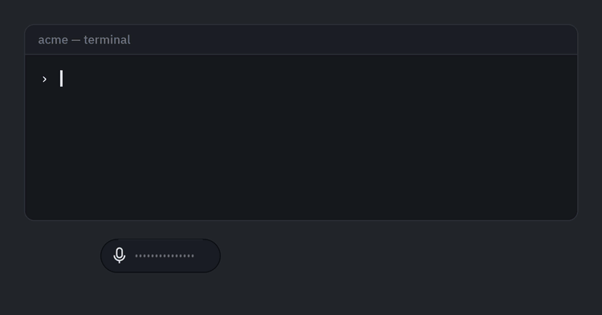

# Flow

Dictate into whatever window you were working in, fix the text by talking to it, then
paste. Or hand the draft to the agent CLI you already have, work the prompt over, and
paste the version you settled on.

Speech recognition runs on your machine. No API key.

**English only · three dependencies · Windows in full, macOS and Linux in
[Lite](#flow-lite-macos-and-linux)**



*Recorded by [`scripts/reel.py`](scripts/reel.py) against the real windows — no
microphone, no model, nothing pasted.*

## Install

```bash
uv tool install git+https://github.com/samartomar/flow
flow
```

No Python? Take
[`flow-windows-x64.zip`](https://github.com/samartomar/flow/releases/latest/download/flow-windows-x64.zip)
instead — that link always serves the newest release. It is unsigned, so the first launch
shows Windows SmartScreen and takes **More info → Run anyway**, once.

You need [`uv`](https://docs.astral.sh/uv/), which fetches Python 3.12 and the three
dependencies itself, and a microphone.

An agent CLI — `codex` or `claude` on PATH, already signed in — is **optional**. It adds
semantic rewrites, the prompt polish and converse mode. Without one, startup prints
`refine CLI: NONE` and everything else works.

[The guide](docs/guide.md#install) has the rest: cloning to change it, trimming ~106 MB
of unreachable dependencies, and why a `.cmd` launcher from `npm -g` is refused.

## Flow Lite (macOS and Linux)

Off Windows, Flow starts in **Lite** without being asked — `--lite` runs the same code on
Windows if you want to see it. Startup says which one you got:

```
Flow Lite on darwin: Send copies the draft and you paste it - no injection,
no global hotkeys, nothing to grant but the microphone.
```

**Lite is the brain, the ear and the clipboard.** Both decoder tiers, the correction
loop, the lexicon, the calibrated profile, the prompt polish, the thread and converse
mode are all there, unchanged. What changes is the last inch: **Send copies the draft and
you press Ctrl+V yourself.**

Four things it does not do — exclusions, not gaps: no injection into another
application's window, no global hotkeys, no auto-paste, and no target-window awareness.
What that buys is the property full Flow cannot have: **nothing to grant but the
microphone** — no accessibility permission, no input monitoring, no trusted-application
prompt.

**Push-to-talk works here anyway, and it does not need a hotkey.** Hold the pill, speak,
let go — the words land on your clipboard. A quick click still toggles listening, and
dragging still moves the pill. It is the same gesture Windows gets from `ctrl+win`, on a
button Flow already draws, which is why it costs no permission: a system hotkey is the
part that needs Accessibility and Input Monitoring, and this is not one.

Two requirements Lite cannot meet, named rather than dropped: P7 (safe paste into a
terminal) is a promise about a paste Flow performs, and Lite performs none; and P9's loop
ends on the clipboard, one keystroke short. [docs/product.md](docs/product.md#flow-lite--the-portable-body)
defines the half and the fence around it — features land in full Flow first and reach
Lite only if they survive without hands.

There is no Mac or Linux download. `uv tool install` is the way in, and a native macOS
body is not promised: it is weeks of work plus re-taking every measurement per OS, and
what would fund it is evidence from Lite.

## The loop

1. **Click the pill** (or `ctrl+alt+space`) and talk. The draft floats up above it,
   refreshing about once a second.
2. **Talk to the draft** to fix it — *"change Tuesday to Wednesday"*, *"delete the last
   sentence"*, *"scratch that"*. Anything that is not a correction is added to the draft
   instead. Or press **Edit** and type, which is faster for a URL or a flag.
3. **Send** — the chip, `ctrl+alt+enter`, or saying *"boom"* — pastes into the window you
   were working in.

Nothing sends itself. Stopping leaves the draft on screen waiting for you, and Flow
presses Enter only when you ask for it by name (*"enter boom"*).

Send does not erase, either: *"bring back my last prompt"* and *"follow up: …"* both
reach what you already sent.

## Two modes

**Dictate** is the default: Send pastes.

**Converse** (`ctrl+alt+M`) turns Send into **Ask**. The draft goes to `codex` or
`claude` as a prompt to improve rather than a task to carry out, the answer renders in
the bubble and is read aloud, and **Use this** makes the answer your new draft. Point it
at a project with `--cwd` and the advice is about your code.

## Who it is for

Developers who speak English as a second language, with a strong accent — Spanish,
Indian, Russian and Japanese L1 speakers anchor the design and the benchmarks. That is
what the correction grammar, the calibration pass and the personal lexicon are for.
[docs/product.md](docs/product.md) states why, and what it changes.

## What leaves your machine

**No API key is read, stored or passed anywhere in this codebase.** Audio, the utterance
buffers, the lexicon, the profile and every local edit stay put.

What leaves is what you hand to an agent CLI, which is cloud-backed: the draft tail on a
rewrite, and the question plus the workshop preamble on an Ask. **That preamble names
your workspace, so a filesystem path leaves the machine along with the words** — and a
project path can identify an employer or a client. Set no workspace and nothing of the
kind is sent.

Send also puts the draft on the Windows clipboard, where any clipboard manager or
cloud-clipboard sync you run will see it.

One optional extra opens a socket: the `[edge]` voice pack sends the *text of each spoken
reply* to Microsoft to be synthesised. Install neither extra, or pick any other voice,
and nothing is sent. [docs/architecture.md](docs/architecture.md) § *What leaves the
machine* states the boundary precisely.

## Known limits

The full list is in [the guide](docs/guide.md#known-limitations). The four worth knowing
before you start:

- **Corrections have to be phrased as commands.** *"delete the bit about the standup"*
  works; *"I feel it should not contain the summary"* is appended to your draft as text.
  The first recording from an Indian-L1 speaker phrased every correction the second way
  and **0 of 10** were recognised. The cause is register rather than accent, and it is
  unfixed — **Refine** forces the next utterance to be read as an instruction, and
  **Edit** lets you type the fix instead.
- **A personal lexicon cuts both ways.** Measured on EdAcc with `small.en`, it recovers
  **27–34%** of the rare words the model otherwise missed, and makes WER **14–38%
  relatively worse** on speech containing none of the terms. Add words you say often, not
  every word you know.
- **Partials refresh about once a second, not per word**, and can contain nonsense
  mid-word. They are shown dimmed and always replaced by the final text.
- **Accuracy on your own voice is unmeasured.** The per-accent numbers come from
  recordings of other people. `scripts/live_check.py` measures yours.

## Docs

| | |
|---|---|
| [docs/guide.md](docs/guide.md) | the manual — every flag, every spoken command, both modes, voices, calibration, vocabulary, what is stored where |
| [docs/product.md](docs/product.md) | what Flow is for: the target user, the P1–P9 requirements, the non-goals |
| [docs/architecture.md](docs/architecture.md) | runtime reference: data flow, threads, the event stream, the tuning constants and their measurements |
| [docs/roadmap.md](docs/roadmap.md) | the gap between the product definition and this build, with the accent benchmark that measures it |
| [docs/analysis.md](docs/analysis.md) | requirements breakdown, the four architectures considered, ranked risks |
| [docs/development.md](docs/development.md) | layout, tests, the harnesses, the scripts, building a distributable |
| [docs/history/PROGRESS.md](docs/history/PROGRESS.md) | the build log, including the things that broke |

## Contributing

Collaborators welcome — especially anyone who speaks accented English and can tell me
where Flow mishears them. That is the one thing I cannot measure alone.

```bash
git clone https://github.com/samartomar/flow && cd flow
uv sync && uv run flow                          # run it
uv run python -m unittest discover -s tests     # 1,965 tests, ~42 s, no mic needed
uv run python scripts/selfdrive.py              # the end-to-end harness
```

Open an [issue](https://github.com/samartomar/flow/issues) for a mishearing — what you
said, what appeared — or a pull request for anything else.
[docs/development.md](docs/development.md) has the layout, the harnesses and the scripts;
[docs/decisions.md](docs/decisions.md) is why things are the way they are.

MIT licensed.
