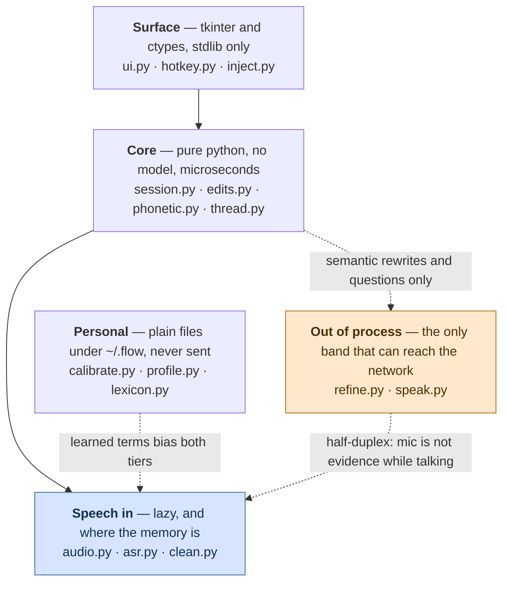
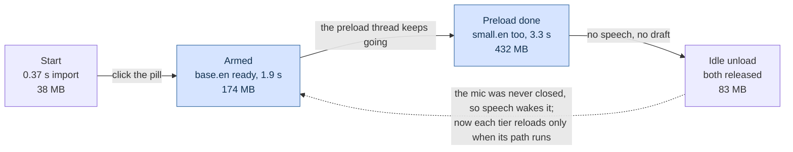

# Architecture — how Flow actually runs

The runtime reference. [product.md](product.md) says what Flow is for, [analysis.md](analysis.md)
records the design decisions and the options rejected, [roadmap.md](roadmap.md) maps the gap
between the two. This file is the thing you read before changing code: what runs where,
what talks to what, and which constants have a measurement behind them.

Every constant quoted here was read from the source, and every runtime claim was checked
against a run — see [Verification](#verification) at the end.

---

## 1. The parts

Seventeen modules in five bands. The bands are drawn by *cost*, not by feature: the top
two are pure Python and stdlib, which is why the pill is on screen in 0.40 s and why a
literal correction is microseconds. The three declared dependencies only matter in one
box, and only two boxes are another process.



The three dotted edges are the couplings that are not obvious from the data flow below:
the agent CLI is reached only for a rewrite or a question, Flow goes deaf while it talks,
and what the profile learns is merged into the lexicon at read time — never written into
the user's own file — so the merged result biases both decoder tiers.

### What leaves the machine

That band used to be labelled "nothing leaves the machine", and the label was wrong. It
described the *process* boundary — no API key is read, no HTTP client is linked (R9) —
and read as a *data* boundary, which it is not: `codex` and `claude` are cloud-backed
CLIs, and starting a local executable is not the same as staying local. The data
boundary is this:

- **Always local.** Microphone audio, the utterance buffers, the lexicon, the profile,
  every local edit, and SAPI speech. R9 is enforced by absence — there is no code in
  those modules that could send anything anywhere.
- **Sent to the configured agent CLI, and so to its provider.** A Refine sends the
  draft tail (≤ `refine.MAX_CHARS`) plus the instruction; an Ask sends the question
  tail, the thread tail, **and the workshop preamble** — which names the workspace, so
  a filesystem path leaves the machine along with the words. That is the one piece of
  non-dictated content Flow adds to an outgoing call, and it is worth stating plainly
  rather than leaving somebody to find it: a project path can identify an employer, a
  client or a codebase. Set no workspace and nothing of the kind is sent.
- **Network, but never user content.** The first decode of each tier downloads its
  model from Hugging Face.
- **The desktop boundary.** Send places the draft on the Windows clipboard, where any
  clipboard manager or cloud-clipboard sync the user runs will also see it.

The startup diagnostics name the CLI that will answer, the notes name the one about to
be used and the one that did, and switching into converse mode says in words that the
question leaves the machine. The pill *stands* there saying so too: the converse marker
under the mic glyph reads `codex` or `claude` — the name of the CLI that would answer,
pin included — and falls back to `ASK` when none is on PATH, because naming a provider
that is not there is worse than naming the mode. The PATH lookup behind it happens once
and again whenever the menu opens, never per frame: `available()` measures 10.2 ms here,
which is 34% of the 30 ms the UI thread has to draw in.

| Module | Band | Does |
|---|---|---|
| `ui.py` | surface | the pill and the draft bubble, DPI-aware |
| `hotkey.py` | surface | `RegisterHotKey` on its own message-loop thread |
| `inject.py` | surface | clipboard + `SendInput`, terminal-safe paste (P7) |
| `session.py` | core | the state machine and the pump |
| `edits.py` | core | routes an utterance, applies the local edits |
| `phonetic.py` | core | vendored Double Metaphone, span search |
| `thread.py` | core | what has already been sent (P6) |
| `audio.py` | speech | mic capture and the speech gate |
| `asr.py` | speech | faster-whisper in two tiers — **the only module that holds a model** |
| `clean.py` | speech | rejects text the model invented, with the evidence |
| `calibrate.py` | personal | measures this room and this voice (P8) |
| `profile.py` | personal | what was measured and learned, as JSON |
| `lexicon.py` | personal | the user's own terms to bias toward, and the corrections to apply after decoding; re-read on change |
| `refine.py` | external | rewrite, polish (P5) and the converse ask (P9) — which carries the workshop preamble and the workspace it is grounded in |
| `speak.py` | external | one long-lived SAPI host; owns `speaking`, which gates the mic, and which voice reads the reply |

## 2. The loop, end to end

```
  microphone
      │  float32 mono, 16 kHz, 1024-sample blocks (64 ms)
      ▼
  Mic ─────────────── bounded queue, 256 blocks (~16 s), drops oldest when full
      │               and says so: Session._pump_overflow turns the growth of
      │               Mic.dropped into one note naming the audio that went
      │
      ▼
  SpeechGate ──────── RMS vs an adaptive noise floor, 800 ms hangover,
      │               256 ms of pre-roll handed back when it opens
      ▼
  utterance buffer ── cut and committed at 24 s, whatever else happens
      │
      ├── every ≥0.7 s of new audio, if the worker is free ──▶ partial decode
      └── on end-of-speech, or at the 24 s cut ──────────────▶ final decode
      │
      ▼
  DecodeWorker ────── one thread. Partials latest-wins, finals FIFO,
      │               rescues FIFO. A decode failure never kills it.
      ▼
  clean.invented_reason ── two signals must agree before anything is dropped;
      │                    every rejection is kept with its evidence
      ▼
  Lexicon.apply ───── declared "wrong -> right" corrections, whole words, one pass.
      │               Here because everything downstream — the router, the undo
      │               stack, the paste — reads what the decode returned
      ▼
  Session._route ──── append | local | semantic | undo | rescue | recall | followup
      │
      ├── append ────▶ Draft.append
      ├── local ─────▶ edits.apply_local          microseconds, no subprocess
      ├── undo ──────▶ Draft.undo
      ├── rescue ────▶ re-read the last append as a command
      ├── recall ────▶ pull the last sent prompt back
      ├── followup ──▶ mark the draft as a continuation
      └── semantic ──▶ refine.refine()            agent CLI, ~6 s, off-thread
      │
      │                    the keyboard ── Bubble's Edit chip ──▶ Session.commit_edit
      │                    enters here, beside the router and not through it: a hand
      │                    edit is not an utterance, so nothing classifies it
      ▼                    (microphone suspended and countdown held while it is open)
  Draft (text + bounded undo stack)
      │
      ▼
  Send
      ├── DICTATE  ──▶ inject.paste()   clipboard + SendInput, terminal-aware
      └── CONVERSE ──▶ refine.ask()     agent CLI, reply rendered + spoken
                            │
                            ├──▶ Thread (bounded), so the next question has context
                            │
                            └──▶ Session.take_reply()   the "Use this" chip, or
                                 the answer *becomes* the draft, replacing it,
                                 and the mode flips to DICTATE so the next Send
                                 pastes rather than re-asking Flow's own answer
```

That last arrow is the loop closing. Converse mode is where a prompt gets discussed and
refined, and until it existed the refined prompt was in the *reply* while `send()` handed
over the *draft* — so the only way across was to re-type it. Replace and not append: an
answer is a whole thing, and gluing it onto a half-written question makes a third thing
nobody asked for. Undo is what makes that safe, and the note names what was displaced.

The rule that shapes all of it: **the agent CLI is never on the hot path.** A CLI call was
measured at ~7 s, which is slower than fixing a word by hand, so `edits.py` exists to keep
every literal correction away from it.

## 3. Threads

Ten things run concurrently. Getting this wrong is the main way to break the app, so it
is written down.

| Thread | Started by | Does | Rules |
|---|---|---|---|
| main / UI | `Pill.mainloop()` | `Pill._tick()` every 30 ms → poll the foreground → `Session.tick()` → repaint | **The only thread that may touch Tk.** `_tick` re-schedules itself in a `finally`, so an exception cannot break the chain and leave a dead pill on screen. The foreground poll is two user-mode calls and is where `paste_target` comes from — asking at paste time asks after the click. The one thing that stops this thread is the right-click menu, which is a native `TrackPopupMenu` running its own modal loop |
| PortAudio callback | `Mic.start()` | copies each block into the queue, updates the level | No allocation-heavy or blocking work. Never touches the session — which is exactly why `Mic.level_db` is not what the meter draws: it reports the room whether or not anything is reading the blocks. `Session.level_db` is the honest one |
| `decode` | `DecodeWorker.__init__` | runs the model | Owns the only model calls. Catches every exception and turns it into an `error` result |
| `preload` | `Session.start()` | warms both tiers | Not awaited — a first run includes a model download, and doing it inline froze the UI on the first click |
| `hotkeys` | `Hotkeys.start()` | `RegisterHotKey` + `GetMessageW` message loop | `RegisterHotKey` requires the message loop to be on the registering thread. Presses go back through a `queue`, drained on the UI thread |
| `refine` | per semantic rewrite | one `refine._invoke` | Result handed back under `_refine_lock`, tagged with its operation id and the draft revision it was computed from. Watches `Session._cancel` while it waits, so `close()` does not have to |
| `ask` | per converse question | one `refine._invoke` | Result handed back under `_ask_lock`, tagged with its operation id. Same cancellation |
| `clipboard-restore` | per paste | sleeps `RESTORE_DELAY_SEC`, puts the old clipboard back | Lets the target app read the clipboard first, then checks `GetClipboardSequenceNumber` against the reading taken when Flow's own text landed — a changed counter means the user copied something in that pause and the old text is not written back. The one thread that appends to `take_warnings()` from off the UI thread, which is why that queue is locked |
| `speech` watcher | each `Speaker.say()` | polls the host until it reports `Ready`, then clears `speaking` | Best-effort only. The ceiling that actually bounds `speaking` is enforced by the reader, so a wedged host cannot leave Flow deaf |
| speech host | first spoken reply | a long-lived PowerShell `System.Speech` process | Not a thread but a subprocess, and deliberately long-lived: a subprocess already launched cannot be told to stop talking, and the state protocol needs it responsive |

Locks: `WhisperTranscriber._lock` (model dict + drop log + confidence), one
`WhisperTranscriber._locks[tier]` per tier held across a model build, `DecodeWorker._cv`,
`Session._refine_lock`, `Session._ask_lock`, `Mic._lock`, `Lexicon._lock`, `Speaker._lock`.

The per-tier lock is not decoration: without it the preload thread and the decode worker
each build a model and one is thrown away. Held *per tier* so preloading `small.en` cannot
block a partial that only needs `base.en`.

## 4. The pump

`Session.tick()` is a pump the caller drives — `tkinter.after()` in the app, a `while` loop
in the headless harnesses. No UI framework is imported in `session.py`.

```python
def tick(self):
    self._pump_audio()     # drain mic, run the gate, submit partials/finals
    self.pump_results()    # everything not waiting on the microphone
    self._pump_health()    # device liveness, idle model unload (R8)

def pump_results(self):
    self._pump_decodes()   # take decode results, route them
    self._pump_drops()     # surface what the filter rejected (P2)
    self._pump_refine()    # collect a finished CLI rewrite
    self._pump_ask()       # collect a finished CLI answer
```

**The split is not cosmetic.** The UI drives the pump only while it is capturing, so
folding the CLI collectors into the audio path meant a disarmed pill lost whatever was in
flight: an answer came back onto `_ask_result` and stayed there forever, because the only
code that reads it sat behind the armed check. A question you have already asked does not
depend on still listening — and disarming while waiting is the obvious thing to do, all
the more so now that Flow goes deaf while it reads a reply aloud.

`Session.events()` drains what happened. The UI never reads session internals; it reacts to
the event stream.

The event stream now has a persistent shadow. `Session.diag` writes the same moments to
`~/.flow/diag.jsonl` with the words removed — a state change records which states, a route
records which kind and how many characters, a CLI call records its operation id, duration,
provider and outcome category. It is a different thing from the event stream and not a
replacement for it: events are how the UI learns what to draw, the trace is what is left
after Flow is closed. See [§9](#9-what-is-written-to-disk) and `flow/diag.py`.

### States

| State | Pill | Indicator | Bars | Meaning |
|---|---|---|---|---|
| `IDLE` | slate | — | live | not capturing, or nothing held |
| `LISTENING` | green | — | live | speech in progress |
| `DRAFT` | amber | — (`Ask 4s` on the button) | live | text held, awaiting refine / continue / send |
| `REFINING` | blue | ⋯ `refining` | live | a CLI rewrite is in flight, ~6 s |
| `ASKING` | violet | ⋯ `asking` | live | a converse-mode question is with the CLI, ~8–10 s |

The last two are held for the whole call. Routing keeps running while a CLI call is out —
the microphone never closed — and it used to end every utterance by setting `DRAFT`, which
took the pill off `REFINING` while the rewrite was still in flight. `ASKING` outranks
`REFINING` when both are out, matching the order `activity` reads them in.

### What Flow is doing, and whether it can hear

`State` is not the whole answer. Three of the things the user waits on are not states at
all — a model build, a decode, and a reply playing — and before this they were invisible,
or worse. `Session.activity` is the one place that answers "what is Flow doing right now",
read every frame by the UI:

| Condition | Indicator | `hearing` |
|---|---|---|
| `speaker.speaking` | ▬ `speaking - not listening` | **False** |
| `state is ASKING` | ⋯ `asking` | True |
| `state is REFINING` | ⋯ `refining` | True |
| `asr.loading` | ⋯ `loading the model` | True |
| `worker.busy and not gate.speaking` | ⋯ `decoding` | True |
| otherwise | — | True |

Checked in that order. Speaking wins because it is the only one that means *stop talking*
rather than *wait a moment*, and a model build is named before the decode it is holding up
because those differ by about a second.

Three points that are load-bearing rather than stylistic:

**It is a polled property, not an event.** A wait has no edges — it is a condition that
holds for a while — and a UI reconstructing "still working" from a start event and an end
event shows a stale indicator the first time one of those is missed.

**Dots for the indeterminate ones, a flat line for the deaf one.** Three marching dots is
the honest shape for a wait of unknown length, where a progress bar has to invent a
denominator. The flat line is the same mark the pill's level bars make at the same moment:
one fact, drawn the same way, in the two places the user is already looking.

**`decoding` is suppressed while the gate is open.** Partials run continuously during
speech, so it would be lit permanently and would say nothing; the bars carry that moment.

**`Session.level_db` is floored to `DEAF_DB` while `hearing` is false.** `Mic._level` is
written by the PortAudio callback, which knows nothing about the echo guard, so during a
spoken reply it tracks Flow's own voice coming back through the speakers — see the
[Verification](#verification) row for what that measured.

### Events

| Kind | Payload | UI response |
|---|---|---|
| `partial` | provisional text | dimmed italic line in the bubble |
| `draft` | the whole held draft | main bubble text; empty hides it, unless `ASKING` |
| `state` | new state name | pill colour |
| `note` | what just happened | small line at the bubble's foot |
| `error` | what failed | red flash + note; the draft is never lost |
| `reply` | the CLI's answer | its own colour, plus spoken aloud |
| `mode` | `dictate` / `converse` | pill badge and chip label (an accompanying `note` is what the user reads) |
| `drop` | a rejected segment with its evidence | shown as a note — P2 is that a rejection is never *silent* |

## 5. Decoding

Two tiers, because one model cannot serve both paths on this CPU.

| | partials | finals |
|---|---|---|
| model | `base.en` | `small.en` |
| beam | 1 | 5 |
| temperature ladder | `(0.0,)` — no retries at all | `(0.0, 0.2, 0.4)` — capped |
| bound by | latency (R4, 1.5 s budget) | accuracy — the draft is held on screen while it runs |

`decode_options()` in [`flow/asr.py`](../flow/asr.py) is the single source both the app and
the benchmarks decode with; a bench that drifts from the app measures a build nobody runs.

Three settings are deliberately non-default:

- `vad_filter=False` — `SpeechGate` already decided this is speech. This is also why
  `onnxruntime` is unreachable and `scripts/slim.py` can remove it.
- `condition_on_previous_text=False` — with context carry-over a long session can fall into
  repetition loops where the model echoes earlier text forever (R8).
- `no_speech_threshold=None` and `log_prob_threshold=None` — these turn off faster-whisper's
  *own* internal segment filter, so Flow has exactly one filter: its own, which records what
  it drops and why. Retrying a decode merely because the model was unsure was measured to buy
  nothing across five accent groups and to cost a lot on near-silence (one 5 s noise clip went
  0.84 s → 3.66 s). Degenerate output still retries, through `compression_ratio_threshold` —
  that is the case where a hotter sample genuinely helps.

Capping the ladder removes Whisper's own escape from repetition loops, so
`clean.collapse_repeats()` and `clean.collapse_phrase_repeats()` break them deterministically
instead.

### Loading, and what it costs



Measured 2026-08-01 with `scripts/soak.py`'s own PSAPI reader, two runs agreeing to
0.5 MB, models already in the HF cache: 38.3 MB after import, 174.2 MB at 1.89 s when
`base.en` becomes resident, 431.7 MB at 3.25 s when `small.en` joins it, 82.8 MB after
the idle unload. The unload was reached by winding `IDLE_UNLOAD_SEC` to zero and
ticking — the real path in `_pump_health`, not a direct call to `unload()`. Every
figure is a little under what this section said before, and the shape is unchanged:
the finals tier is the expensive half, and releasing both gives back more than
arming cost because the import itself is not what is large.

Arming pays for both tiers, deliberately. `Session.start()` spawns the preload thread and
does **not** await it — a first run includes the download, and doing that inline froze the
whole UI on the first click with nothing on screen to explain why — and that thread warms
`base.en` first, then `small.en`, so the fast tier is ready soonest and the first final is
a decode rather than a model build. An earlier version of this section claimed a session
that never finalises an utterance never pays for `small.en`. That is a property of
`WhisperTranscriber` on its own, not of the app — the preload row in the thread table had
said "warms both tiers" all along, and the code agrees. Where the lazy per-tier load is
real is **after** an idle unload: nothing preloads a second time, so a wake-up reloads
only the tier the next decode actually needs.

The idle unload at `IDLE_UNLOAD_SEC` releases both models and **keeps the microphone open**.
That is a deliberate narrowing of the original design, which released the mic too: releasing
it would leave the app unable to hear its own wake-up, and a mic is cheap where a model is
hundreds of megabytes.

Memory figures are recorded from earlier soak runs, not re-measured for this document.

### The drop filter

`clean.invented_reason()` returns which rule rejected a segment, or `None` to keep it.
**Two independent signals must agree before anything is discarded**, because dropping a real
word is worse than admitting a rare invented one — the user can delete a stray word but
cannot recover one they were never shown.

```
no_speech_prob ≤ 0.6                         → keep
no_speech_prob > 0.6  and  whole utterance is a known filler   → "filler"
no_speech_prob > 0.6  and  avg_logprob < confidence_floor      → "unconfident"
otherwise                                     → keep
```

`confidence_floor(baseline)` is `min(-0.8, baseline - 0.5)` — `min`, so calibration can only
ever *relax* the bar. Shortness is deliberately **not** a signal: a spoken correction *is*
short, so dropping on length preferentially deletes commands from the people whose speech
scores worst on `no_speech_prob`, which is exactly the user Flow is for.

The same `avg_logprob` this filter reads — the worst among the segments a decode kept,
drained by `take_confidence()` — is now also written onto every **route** record in the
trace. Nothing reads it to decide anything. It is there because the router picks between
a local edit and a ~7 s CLI call without ever having seen how well the sentence was
heard, and the live sheet turned 2 of 33 spoken commands into garbled semantic
instructions; a gate on this number was declined for want of a real distribution, and
this is where that distribution comes from. `null` means the decoder reported nothing and
must never be read as a good score — it is written rather than omitted so the gaps can be
counted too.

## 6. Routing

`edits.plan(utterance, draft)` decides what a spoken utterance means. The draft is a required
argument, not decoration: *"Delete key handling is broken"* is dictation and *"delete key
handling"* is an instruction, and nothing in the words separates them — what separates them
is whether the target text exists in the draft.

Two passes. The utterance is read as spoken; only if that produces no local edit is it
re-read with a snapped verb, and **that reading is accepted only when it yields a local edit
whose target is really in the draft.** So a guess can promote a mis-heard command and can
never demote dictation into an edit.

| Plan kind | Trigger | Cost |
|---|---|---|
| `rescue` | "that was a command / an instruction / an edit" | re-read, ~2 s if it needs the audio |
| `recall` | "bring back my last prompt" | instant |
| `followup` | "follow up", "also", "one more thing" (+ optional rest) | instant |
| `undo` | "scratch that", "undo", "never mind", "forget that", "strike that" | instant |
| `local` | a literal correction whose target is in the draft | microseconds |
| `semantic` | a rewrite verb, or `op="polish"` | ~6 s, agent CLI |
| `append` | everything else | instant |

Local operations: `replace`, `replace_all`, `delete`, `delete_last`, `delete_range`,
`insert_before`, `insert_after`, `capitalize`, `upper`, `lower`, `break`.

Three mechanisms make the grammar survive an accent:

**Lead-in absorption.** Every pattern takes a repeatable prefix of hesitation *and*
politeness — `no`, `sorry`, `wait`, `actually`, `can you`, `could you please`, `just`, `let's`.
Politeness was the missing half: those forms were being appended into the draft verbatim.

**Verb snapping.** Edit distance (bounded at one), adjacent transposition, suffix stripping
(`deleting` → `delete`), and an explicit table of observed mis-hearings (`the lead` → delete,
`stop` → swap, `leplace` → replace). Only applied to utterances of ≤ 6 words after the
lead-in, because every command in the inventory is five words or fewer and a guess about a
long utterance is a guess about a sentence.

One noun is snapped the same way, and only one: inside "make/turn it (into) a *proper·good·
better·…* X", a known mis-hearing of "prompt" is read as "prompt" (`_MISHEARD_PROMPT`). Live
run 1 said "make it a proper prompt" and got back **"Make it a proper brown"**, which routed
to a generic CLI rewrite instead of the prompt-shaping pass. A table rather than a threshold
because the numbers leave no room for one: "brown" scores 0.36 against "prompt" and shares no
phonetic key with it, while "proper" itself scores 0.67 — any bar that admits the mis-hearing
admits words that mean something else in the same frame. It is bounded on all three sides: the
exact reading is tried first, the frame has to match whole, and it changes *which* instruction
a semantic plan carries, never whether one is sent — so the worst case is a prompt-shaping
pass where a generic rewrite was wanted, and the mis-heard word never reaches the CLI at all
(`refine(polish=True)` substitutes its own prompt).

Spelling variants belong to the patterns rather than to either table: `lower case` is the
same operation as `lowercase`, as `all caps` already was to `uppercase`. Runs 1 and 3 of the
live sheet returned one token for that command and run 2 returned two, from the same speaker
saying the same words.

**Elisions belong there too**, and for the same reason — they are a way the same phrase comes
out, not another phrase. `_FOLLOWUP` accepts `follow` immediately before `and`, because live
run 1 said "follow up and mention the rollback plan" and the decoder dropped the unstressed
"up" between two stressed words. "roleback" was never the problem: it scores 0.938 against
"rollback", comfortably over `MATCH_THRESHOLD`. **Bare `follow` stays refused** — "follow the
steps in the README" is a sentence somebody dictated — so the lookahead is the whole safety
argument, and it is priced rather than argued: run against `command_bench.py`'s corpus before
being admitted, **0/580** misroutes on real utterances (unchanged), adversarial 5/20
(unchanged), corruption-class recall 100% on all six classes, threshold sweep identical. The
whole result file came back identical apart from its date, because the corpus contains no
"follow and" utterance at all — which is what "costs nothing" means here.

**Converse mode is a prompt workshop.** `_start_ask` frames every outgoing question
with `session.WORKSHOP`: the CLI is helping refine a prompt for an agentic coding CLI,
the workspace is X, discuss and improve the prompt rather than carrying it out. The
definition came from use rather than from design — general conversation was tried at the
desk and failed on its own merits (no internet access, and hallucinations), while talking
a prompt into shape worked. `docs/product.md`'s P9 says so now.

The framing **trails** the question, and is cut to fit before it is handed over. Both are
defect fixes rather than style. `ask()` keeps the tail of an over-long input *and walks
the cut forward to a sentence boundary* — so with a long question containing no
punctuation, the first boundary it finds is inside the framing itself. Measured: a
5 000-character question arrived at the CLI as two sentences of instructions and none of
the prompt. Keeping the framed string inside `MAX_CHARS` makes that split a no-op, so the
framing survives by construction.

The workspace comes from `--cwd`, else the profile's `workspace`, else nothing —
`profile.resolve_workspace`, precedence matching `--voice`. It is named at startup and
again on every mode switch, and that visibility is the whole bargain: a workspace set
today goes stale silently when a project moves, and the mitigation chosen was that a
wrong grounding is on screen rather than clever. A stored path that no longer exists is
reported and dropped, because a startup that refuses over a stale setting is worse than
an ungrounded ask.

**The send triggers.** `send_trigger` is checked first of all and with no draft condition, because it presses a button and a button that works only when the router likes the draft is one that sometimes does nothing. It is also ahead of the snapping passes: a trigger is an exact word by construction, and letting a verb snap *toward* one would be edit distance deciding to execute something. Section 7 has the rest. Note that `plan()` takes the words as an argument -- the session passes the profile's, and `_route` calls `plan()` twice, which is how a renamed trigger briefly turned the shipped word into an unhandled plan that `_escalate` spent a ~7 s CLI call on.

**The thread verbs.** `recall` brings the last sent prompt back, `followup` marks the
next thing said as a continuation, and `take` moves the CLI's answer into the draft.
All three mean something with an *empty* draft, which is why they are checked before
the empty-draft early return — and an empty draft is exactly the state Send leaves
behind, and the state an answer arrives into. `take` is whole-utterance only: "use
that answer" is the command, "use that answer in the summary" is prose, and a false
fire therefore needs the speaker to have said nothing else. Priced before admitting,
as `follow and` was — **0/580** on the real-utterance corpus, adversarial 5/20, recall
100%, the whole result file identical bar its date. The **Use this** chip on the
bubble does the same thing and is the floor: it cannot be mis-decoded, and this loop
has to work for somebody the decoder keeps mis-hearing.

**Phonetic target matching.** `phonetic.find_span()` — vendored Double Metaphone blended with
spelling, threshold `MATCH_THRESHOLD = 0.82`, searching word windows sized around the
target's own word count ±1, because a mis-transcription moves word boundaries as readily as
letters. Both the router's `in_draft()` and every span operation in `apply_local()` go
through it.

`plan()` also marks `escalated=True` when the shape was a correction but the target was
nowhere in the draft. That is likelier a mis-hearing than a request for judgement, so it
earns one biased re-decode (`edits.command_bias()`: every trigger verb plus the draft's own
long words, capped at 48 terms) before any CLI call.

## 7. Send

### Dictate

`inject.paste()` classifies the target window **before** it touches the clipboard — window
class or process name, via ctypes — then `prepare()` decides what is safe to send.

**Which window is the target is not a question to ask at paste time.** It used to be:
`paste()` called `GetForegroundWindow()` itself, which runs *after* the click on the Send
chip. Neither of Flow's toplevels carried `WS_EX_NOACTIVATE` — measured exstyle `0x00080088`
on both, TOPMOST | TOOLWINDOW | LAYERED — so that click made Flow the foreground window and
the answer was Flow. Everything downstream then followed from a Tk canvas: the `SendInput`
Ctrl-V went to a widget that ignores it, `prepare()` decided a canvas is not a terminal and
skipped the newline strip that is P7's one guarantee, and `paste()` returned True anyway.
Measured before the fix, with a real mouse click on the chip: nothing arrived in an
ordinary window, nothing arrived in a console, and Send reported success both times. Not
one prompt had ever landed this way.

Three things now hold, and they are independent on purpose:

1. **Both toplevels carry `WS_EX_NOACTIVATE`**, applied by `ui._no_activate` after the
   windows exist and **read back** — `SetWindowLongPtr` returns the previous style word, so
   a call that did nothing is indistinguishable from one that worked unless you ask again.
   It has to be set on the `TkTopLevel` parent of `winfo_id()`, not on the `TkChild` it
   returns; the first version wrote it to the child *and read it back off the child*, and
   the read-back agreed with itself.
2. **The caller names the window.** `Pill._tick` polls the foreground every 30 ms and keeps
   the last one that was not Flow's own, and `Pill._send` passes it to `paste(hwnd=…)`.
   That is what fixes the *classification*, independently of where the keystroke goes.
3. **A target that resolves to Flow is refused**, with a reason, because a Ctrl-V into
   Flow's own canvas does nothing whatever the caller believes. See invariant 10.
4. **And so is a target that moved.** The named window is a claim, checked against the
   live foreground at paste time. Flow used to be the only foreground worth refusing
   for; anything else that took focus inside those 30 ms — a notification, a switcher,
   an installer finishing — received the keystroke, carrying a payload prepared for the
   window it was aimed at rather than the one it reached. A foreground of `0` is
   deliberately not a refusal: that is the OS declining to answer, not evidence that
   somebody else is holding it.

### Send, spoken

Two words press it. `boom` pastes; `enter boom` pastes and then submits with Enter, and
they are the last keyboard step in the workshop loop -- item 21 takes the reply, this
sends it. Both are stored in `profile.json` and both have shipped defaults that work out
of the box, because a feature needing a text editor before first use is dead on arrival
for the person who asked for it.

**The safety is inherited, not new.** A trigger emits a request; `Pill._send` handles it
and calls the same `session.send()` the chip does, so an empty draft gets the existing
"nothing to send", an in-flight ask or refine gets the existing refusal, and invariant
10's target revalidation happens exactly where it always did. There is no second Send to
keep in step with the first.

**Whole-utterance matching** is what makes a false fire rare: the word is a command only
when it is the entire thing said, so "boom goes the dynamite" is dictation and a mis-fire
needs the speaker to have said nothing else. Measured against the 580 real EdAcc
utterances: **none of them fires either trigger**, and the single one containing the
substring at all ("...MAYBE ENTERING THERE BECAUSE...") does not.

**The order of the two defaults is deliberate.** A decode that loses a word from "enter
boom" yields "enter" (no trigger) or "boom" (paste without submit): degradation falls
away from execution, never toward it. That property is what makes a spoken *execute*
trigger acceptable at all, and it is asserted rather than described.

**The Enter goes after the paste, inside the same call, to the already-validated
target.** Every refusal has run by then, so a submit can only reach a window that took
the text -- a stray Enter would run whatever was already sitting on a shell prompt. P7 is
untouched: the payload still loses its trailing newline, so there is exactly one submit
and the user called for it. Under bracketed paste the block stays inert until that
keystroke, which is deliberate execution done deliberately. Measured in a real console,
twice: without the submit the line sits on the prompt and no marker file appears; with
it, the same line ran.

Known risk, recorded: "boom" is a short plosive and may decode as "bhoom" or as nothing
for the anchor accents. A lexicon arrow line repairs a consistent bend (`bhoom -> boom`);
if it will not decode at the desk, the fallback is renaming the default in code, not
asking the owner to edit JSON.

### The one window that deliberately takes the focus

The Edit chip opens the draft in a real `tk.Text` inside the bubble, and to receive a
keystroke that window has to be activated — which runs straight at everything above.
Three things make it safe, and two of them were measured rather than reasoned.

The **refusal survives it**, because it never depended on the style. `resolve()` asks the
OS what has the foreground *now* and compares process ids, so Flow holding the focus
makes the refusal fire rather than lapse: measured on a real desktop with the editor open,
`resolve()` returned `Target(class='TkTopLevel', process='python.exe', flow)` and
`paste()` returned False with "not pasted: Flow had the focus, not the window you were
aiming at". **The aim survives it** too — `_track_target` only ever records a foreground
that is *not* Flow's own, so the window being dictated into is still the one a later Send
is pointed at.

And the **focus grab is verified, not assumed**. `SetForegroundWindow` is refused for a
process that does not own the last input event, and it reports that refusal by doing
nothing — which would leave a text box on screen, with a cursor blinking in it, while
every keystroke went somewhere else. That is not hypothetical: driven programmatically
instead of from a click, the box opened and the word typed into it landed in the browser
behind. So the foreground is read back afterwards, and an editor that did not get it
closes itself and says why. From a click — which is how the app reaches it, and which is
what earns the call — it is granted; the whole path was driven with a real mouse click
and real `SendInput` keystrokes, 15/15.

The clipboard is borrowed, not taken. Flow writes the payload, sends Ctrl-V, waits
`RESTORE_DELAY_SEC` for the target to read it, and puts the previous text back — but only
if `GetClipboardSequenceNumber` still reads what it read when Flow's own text landed.
0.6 s is long enough to copy something; it is one keystroke, and the reason the pause
exists at all is that people are doing things. The unconditional write that used to
follow was not a restore, it was Flow deleting what the user had just copied and putting
back what they had copied before. A counter of `0` means the OS declined to answer and is
not treated as evidence either way. **Known limit:** only text is captured, so a clipboard
holding an image or a file list is emptied by the paste and never restored.

The one guarantee: a draft ending in a newline never reaches a shell with that newline
attached, because that does not paste, it *runs*. Interior newlines are explicitly not a
guarantee and are reported rather than rewritten; silently reflowing someone's text to make
it safe is worse than telling them. Those reports had never been shown to anyone either —
`inject.take_warnings()` existed, was imported by `__main__`, and was drained by nobody.

### What Send leaves behind

The bubble used to be withdrawn on the same line that sent the draft, so a paste that
landed and a paste that went nowhere left the same empty screen. It now holds the sent text
for `ui.SENT_LINGER_SEC` under a `sent` label with a **Put it back** chip, which calls
`Session.recall()` — the same path the spoken *"bring back my last prompt"* takes. Dictate
mode only: in converse mode the bubble is already staying up for the answer.

### Converse

`Session.send()` returns `""` in converse mode by construction, so the question can never be
pasted into whatever window happened to have focus. The draft goes to `refine.ask()` with the
thread tail *minus the current turn* — passing the current one would ask the CLI not to answer
the thing it was just asked.

`ask()` is deliberately not `refine()`. `refine()` guards hard against the model returning
anything longer than what it was given, because commentary pasted into a draft is a defect.
An answer *is* commentary, so that guard would reject every correct result.

An answer is also not the only thing Ask returns. A request for a piece of work — "give
me a complete reusable prompt", "list all the edge cases we discussed" — gets the
artifact brief instead of the three-sentence one: no length ceiling, requested structure
honoured, the wider `ASK_ARTIFACT_MAX_CHARS` render bound. The profile is chosen from
the request before the CLI is called, and the spoken half changes with it — a long
artifact is rendered whole and *spoken* as a one-line pointer, because Flow is deaf for
exactly as long as it talks and a read-aloud prompt would cost minutes of that.

## 8. Constants, and what is behind them

Only the ones with a measurement or a failure behind them. Everything else is in the source.

| Constant | Value | Why |
|---|---|---|
| `MAX_UTTERANCE_SEC` | 24.0 s | Whisper pads to one 30 s mel window, so cost is flat below it and climbs past it. Cut before the boundary keeps latency constant in a long session |
| `PARTIAL_MIN_GROWTH_SEC` | 0.7 s | Paired with the worker-idle check, this is what bounds partial latency |
| `IDLE_UNLOAD_SEC` | 300 s | Release the models, keep the mic. Releasing the mic would leave the app unable to hear its own wake-up |
| `MIC_CHECK_SEC` | 5 s | A dead PortAudio stream stops delivering blocks without raising anywhere the session can see. What it reopens onto may not be what went away — unplug a USB mic and the laptop array takes over — so the reopened device is compared against the one the profile was calibrated through, and a mismatch is said once |
| `FORCE_NEXT_TTL_SEC` | 30 s | A Refine/Continue chip means "the next thing I say"; after this long the next thing someone says is a different thought. The chips also toggle, because a one-way door that lasts 30 s reads as the app being stuck |
| `AUTO_ASK_SEC` | 4 s | Converse mode only. Measured: the pauses a speaker leaves between separate spoken items run 1.4–3.3 s (median 2.5 s) on the one recording where every item was located, and each gap also contains a spoken item number, so real silence is shorter — under ~3.3 s fires mid-thought. R5 still holds where it matters: pasting into a window is irreversible and stays manual, asking is not |
| `ui.SENT_LINGER_SEC` | 4 s | How long the bubble holds what a dictate-mode Send just handed over, with the chip that puts it back. Deliberately **not** `AUTO_ASK_SEC`, which is also 4 s and is a different four seconds: that one is how long a settled draft waits before asking itself, this is how long words stay recoverable after they have gone, and either could move without the other. The number it replaces was zero — the bubble was withdrawn on Send, so a Send that went nowhere and a Send that worked left the same empty screen |
| `ui.DOT_SEC` | 0.4 s | One dot of the indeterminate-wait animation. The bubble renders on events and a wait has no events, so the frame is computed and compared before anything is drawn — at this cadence that is ~2.5 repaints a second instead of the 33 that redrawing every pump would cost. Same discipline as the auto-ask countdown |
| `DEAF_DB` | −120.0 | What `level_db` reports while the microphone is not evidence. Below any real room — a quiet room with a good USB mic measures −96.7 dB — so every meter maps it to silence without having to know why |
| `speak.HOSTS` | `pwsh`, then `powershell` | Which PowerShell speaks. Not a style choice: `System.Speech` is a .NET API with two implementations that do not enumerate the same voices. Windows PowerShell 5.1 reads only the legacy SAPI5 token store; PowerShell 7 also reads OneCore, where Windows registers everything modern — natural voices included. Measured: **2 voices under `powershell`, 9 under `pwsh`** on the same machine. The same executable must list *and* speak, or the menu offers names `SelectVoice` will quietly refuse |
| `speak.WORDS_PER_SEC` | 1.5 | Half the measured rate (a 15-word sentence took 4.9 s at rate 1), so the derived ceiling on `speaking` is generous. It gates the microphone, and a latched value would leave Flow permanently deaf — far worse than leaking a little echo |
| `BLOCK` | 1024 (64 ms) | Fine enough for a responsive level meter |
| `PREROLL_BLOCKS` | 4 (256 ms) | A gate can only open after hearing something loud, so the quiet head of that word is already gone — the unaspirated stop, the soft fricative. Without it "delete" becomes "leet". Measured: gating without pre-roll deletes 2.6% of the audio; any pre-roll from 128 ms up returns WER to the ungated level |
| `FLOOR_MIN_DB` | −100.0 | It was −70, and a quiet room with a good USB mic measures **−96.7 dB** — the floor could never descend to meet it, so the gate never opened at all |
| `FLOOR_MAX_DB` | −25.0 | So no input can make the gate deaf |
| `NO_SPEECH_MAX` | 0.6 | Sits clear of a genuine short fragment (0.099 measured) and below an outright hallucination (0.691) |
| `LOW_CONFIDENCE` | −0.8 | The shipped absolute bar, and the reason `CONFIDENCE_MARGIN` exists |
| `CONFIDENCE_MARGIN` | −0.5 | The distance between the US control's −0.29 median and the shipped −0.8, so a calibrated typical speaker keeps exactly the behaviour they had |
| `MATCH_THRESHOLD` | 0.82 | Swept, not chosen: 10/10 real mis-transcription pairs recovered at 4 false spans in 354; stricter costs three recoveries and buys nothing until 0.90 |
| `SNAP_MAX_WORDS` | 6 | Without it, suffix-stripping turned sentence-opening gerunds into commands — "Deleting a branch does not delete the history" became a delete |
| `refine.MAX_CHARS` | 2000 | Never hand the CLI an unbounded draft (R11). Past this only the tail is sent, cut on a sentence boundary. A Refine keeps the head verbatim and reattaches it to the result — the CLI rewrites only what it saw, and the rest of the draft is untouched rather than lost. An Ask sends only the tail; the head of an over-long question is simply never seen. Both now say so, in notes worded differently because the two behaviours differ, and the figure is `refine.tail_sent()` rather than the constant — the cut walks to a sentence boundary, so a 6300-character draft sends 1995, not 2000 |
| `refine.TIMEOUT_SEC` | 20 s | Measurement put a normal call at 5.7–7.3 s, so the 6 s first sketched would have killed healthy calls. Enforced against the process *tree*: measured, a 0.4 s timeout used to return after 1.37 s and leave the CLI's own child running, because killing a launcher leaves the pipe its child inherited open and the read blocks on it. `codex` now measures 6.6–8.5 s for a one-word answer here, so the headroom is thinner than when 20 s was chosen: `--cli-timeout` raises it, and a breach falls through to the next CLI rather than failing |
| `refine.CANDIDATES` | codex, then claude | A preference order that is now actually walked. Both entry points used to take the first available CLI and stop, while startup printed "(fallbacks: claude)" — so a `codex` timeout produced a dead feature and a message naming a second CLI that was installed, working and never tried. Falls through on not answering at all (start failure, non-zero exit, timeout, empty output); an answer judged *bad* is the output guards' problem, not a reason to pay for a second call. `--cli` pins one, and a pinned CLI is never second-guessed |
| `ASK_SENTENCES` | 3 | The shortest that can carry an answer plus its caveat. Conversational answers only: a request for a piece of *work* — "give me a complete reusable prompt" — is recognised from the request (`edits.is_artifact_request`, matched on the ask and never guessed from the answer) and briefed without the ceiling, because truncating the deliverable the conversation was for is the product failing at its own point |
| `ASK_ARTIFACT_MAX_CHARS` | 12 000 | The artifact render bound — a bound, not a brief: the bubble scrolls, and truncating a prompt someone asked for in full is worse than a tall bubble. The spoken half flips instead: past `ARTIFACT_SAY_MAX_LINES` / `ARTIFACT_SAY_MAX_CHARS` the voice says only "a 12-line answer is on screen", because invariant 6 makes a read-aloud artifact minutes of deafness |
| `ASK_MAX_CHARS` | 4000 | The bubble has to render it |
| `Thread.MAX_TURNS` / `MAX_CHARS` | 20 / 20 000 | R8. Measured: 5000 sends of a realistic prompt settle at 20 turns, 1640 chars |
| `CONTEXT_CHARS` | 1500 | What a CLI rewrite may see — smaller than the store, because context disambiguates a follow-up rather than re-sending the conversation |
| `Lexicon.MAX_TERMS` | 64 | The library truncates its prompt at 223 tokens *silently, mid-term*, which would bias toward a fragment. Terms and corrections share it: one file, one person filling it, and counting them apart would let 64 corrections buy 64 hotwords past the budget |
| `Profile.PROMOTE_AFTER` | 2 | One "change X to Y" is as likely to be the user changing their mind as the model mishearing; twice is a pattern. Two consumers now: it promotes a term to a hotword, and it decides when a pair is worth *offering* in the menu — the same bar for suggesting a substitution as for biasing toward a spelling, though only one of them rewrites what somebody said |
| `Draft.MAX_HISTORY` / `MAX_HISTORY_CHARS` | 30 / 200 000 | 30 snapshots of a very long draft is where undo quietly becomes megabytes |

## 9. What is written to disk

| Path | When | What |
|---|---|---|
| `~/.flow/lexicon.txt` | once, if it does not exist, when the menu's **Open settings folder** is used | the user's own words, in two kinds of line. A plain term biases the decoder toward that spelling; `wrong -> right` is a correction applied to the decoder's *output* — whole words, left side case-insensitive, right side verbatim, one pass so corrections cannot chain. Corrections exist because bias has already failed on a word the speaker keeps having to repeat: live run 1 spent a ~7 s CLI call on "Change Semir to Samir" because the name never survived decoding, and a substitution costs microseconds and no accuracy. What Flow writes is a file of comments — creating it must not switch biasing on for someone who only wanted to find the folder — and it never overwrites one that exists. **The one other thing Flow may write is a single appended `wrong -> right` line, and only on an explicit tap in the right-click menu** (see below): it never edits, reorders, removes or reformats a line, so everything already in the file comes back byte for byte. Re-read by mtime on every decode, which is how a pair added from the menu reaches the very next utterance |
| `~/.flow/profile.json` | `--calibrate`, every Send, choosing a voice, and toggling auto-ask | schema 1. Room, this speaker's confidence, **the microphone the room was measured through**, learned confusion pairs, misroute signatures, which installed voice reads the replies, whether auto-ask is on, the two spoken send triggers (`send_word`, `send_enter_word`), and the `workspace` a converse question is asked from. The device is stored by name, never by index — indexes shift when anything is plugged in, so a stored one would come to mean a different microphone. The last three are additive and all read through a fallback — an older profile loads with no voice and with auto-ask **on**, which is the shipped default, so nobody acquires a preference they never expressed and the schema does not have to move. Written whole to a `.tmp` and moved, so a crash cannot leave a profile that loads as garbage |
| `~/.cache/huggingface/hub/` | first decode of each tier | the models |
| `~/.flow/diag.jsonl` (+ `.1`) | every state change, route, CLI call, overflow and device event, when the app runs without `--no-profile` | A content-free shadow of the event stream: timestamps, state transitions, route kinds, operation ids, durations, provider names, lengths, counters, error *categories*, and — on each route — how well the decoder heard the utterance being routed (`confidence`, the worst `avg_logprob` of the kept segments, `null` for unknown). Field names are an allow-list and the words are a named deny-list that fails at import if the two ever intersect, so a draft cannot get in by being short. Bounded at `diag.MAX_BYTES` with one rotation — two files, a known ceiling, not a log directory. Off unless the app turns it on: a `Session` traces nothing by default, which is why the unit suite does not write here |
| `.bench/` | `scripts/` only | generated audio, benchmark results and manifests. **Tracked**, because a result is a measurement taken at a moment and cannot be re-taken. The volunteer recordings are the deliberate exception, decided 2026-08-01: a recording is a person, so the clips are untracked, rewritten out of history, and live outside the repo — [`.bench/README.md`](../.bench/README.md) says where, and how a fresh clone gets them back. The downloadable accent corpora are excluded and their manifests are not. Every result file carries an `identity` block naming the date, the `faster-whisper`/`ctranslate2` versions and the cache revision of each model tier that run loaded -- a number is a measurement *of a build*, and until 2026-08-01 none of these said which |

Send is the commit point for the profile: rare, user-initiated, and the moment a session's
corrections have proved themselves by surviving to a handoff.

There is no settings dialog, and the two files above are the reason: everything a user can
set is already hand-editable text. Finding it was **half** the gap — this document used to
say it was the whole one, and the owner said otherwise: "unless it is exposed to UI right
click … i will not be able to use it". Knowing where a file is does not make somebody open
it, learn an arrow syntax and type into it. So the menu does both halves: **Open settings
folder** writes `lexicon.txt` if it is missing and hands the folder to Explorer —
`os.startfile`, so R16 keeps its three dependencies — and **the correction offers** put the
pairs Flow has inferred twice straight into the menu, where one tap appends the arrow line
and a **Never offer** submenu records a no that survives a restart. At most three are shown,
most-seen first: the menu is a native modal loop that already costs a measured ~16 s stall
at worst, and it must not grow with the profile. Offering is as far as it goes — an inferred
pair is a guess from a word-level diff, and nothing turns one into a substitution without
being told to. The template's
comments are the documentation for both files, including the measured cost of biasing, on
the grounds that the person about to add forty terms is the one who needs that number.

There is no code in `profile.py` that could send anything anywhere. R9 is not enforced by
policy here; it is enforced by absence.

## 10. Invariants worth not breaking

1. **Tk is touched from one thread.** Hotkeys, decodes, refines and asks all hand results
   back through a queue or a lock and are drained on the UI thread.
2. **The CLI is never on the correction path.** Only `semantic` plans and converse questions
   start a subprocess.
3. **Failure is non-destructive.** Every CLI path returns `(None, reason)` and the caller
   keeps the pre-edit draft. A rescue that fails puts the words back exactly where they were.
4. **No words are dropped silently.** A rejected segment becomes a `drop` event with its
   evidence; a destructive edit reports the words it removed; the undo stack still holds
   them; and the microphone queue says so when it overflows, with how much audio went and
   in units a person can read. That last one used to be the boundary of this promise —
   `Mic.dropped` counted and nothing in the app read it — and it is the case where the
   promise mattered most, because reaching it takes a ~16 s stall of the UI thread (the
   right-click menu's modal loop is the one known way) and the user is by definition not
   watching the pill while it happens. What is still *not* promised is that the audio
   comes back: the queue drops oldest-first and those blocks are gone. The undo stack
   holds words; nothing holds sound.
   The two *deliberate* deafnesses are the same promise kept a different way. While a
   reply plays, and while the hand editor is open, `_pump_audio` drains the device and
   discards every block — and both say so, in a note and on the indicator, which is what
   separates a suspension from a fault. The editor's is the one somebody would otherwise
   diagnose as a broken microphone, since they caused it themselves and by typing rather
   than by pressing anything marked "mute".
5. **Nothing is pasted without an explicit Send.** Stopping speech produces a held draft,
   and text never reaches another window on its own. Converse mode is the one narrow
   exception to the broader claim this used to make: a settled draft may go to the CLI
   after `AUTO_ASK_SEC`, behind a countdown that sits on the Ask button, is held by
   speech, and can be cancelled or switched off — R5 protects the *irreversible* act, and
   asking is not one. Switching it off is remembered, because a setting that decides
   whether words leave the machine unpressed is not one to make the user re-state every
   launch. A Send that refuses says why — a button that does nothing reads as broken.
   "Explicit" means *asked for*, not *clicked*: the spoken triggers press the same
   button through the same refusals, and a word said as a whole utterance is as
   deliberate as a chip. The Enter suffix is the sharper case and is why P7 keeps its
   newline strip -- the submit is one keystroke the user named, not a newline that
   travelled along with the text.
   Taking a reply into the draft (`take_reply`) is reviewed here and changes nothing:
   it moves text *within* Flow, nothing reaches another window, and it flips the mode
   to dictate so the following Send is the ordinary explicit one. It deliberately does
   **not** settle the draft — a taken answer is not an utterance somebody finished, and
   settling it would arm the countdown against Flow's own answer.
6. **Flow does not listen to itself, and does not claim to.** While a reply is playing the
   microphone is not evidence. There is no echo cancellation and there is not going to be
   one (R16), so converse mode is half-duplex and interrupting is an explicit action. A VAD
   does not solve this: the speakers genuinely are producing speech, and a detector will say
   so. The second half of that sentence is the newer half — the guard was discarding audio
   correctly while the level meter animated to the discarded blocks, so the app told the
   truth about what it did and lied about what it heard.
7. **Everything is bounded.** Mic queue, undo history, drop log, decode timings, thread turns,
   lexicon terms, profile pairs, CLI input. A long session must cost what a short one costs.
8. **Three declared dependencies.** GUI, hotkeys, injection, DPI awareness and speech all come
   from `tkinter` and `ctypes` precisely so that list does not grow.
9. **`decode_options()` is the only place decode parameters live**, so the benchmarks measure
   the build that ships.
10. **Flow pastes into the window it was aimed at, or into nothing.** Its own windows are
    out of the activation chain, the window a paste is aimed at is chosen before the click
    rather than after it, and both ways of that going wrong are refused with a reason: a
    target that still resolves to Flow's own process, and a live foreground that is neither
    Flow nor the window the caller named. The first half is new because it had never held:
    the Ctrl-V went to a Tk canvas, which ignores it, and `paste()` returned True — a
    failure with no symptom anywhere, which is why it survived every harness in the list
    below. The second is why "aimed at" is the promise rather than "aimed at, probably":
    the caller polls 30 ms before the click, and 30 ms is long enough for something else
    to take the foreground.
11. **An old result never overwrites newer intent.** Every CLI call carries an operation
    id and the `Draft.revision` it was computed from. A rewrite whose draft moved during
    the ~7 s it took is discarded with a note saying so, rather than deleting whatever was
    said in the meantime; a result for a call nobody is waiting on is ignored. In-flight
    work owns the state until it returns, and `send()` and the converse countdown ask the
    calls themselves rather than reading the pill. A second rewrite is refused while one
    is out, the way a second Send already was.
12. **A CLI call can be ended, and ending it reaches the whole tree.** `_invoke` is the
    one place this codebase starts a process, and it polls a `threading.Event` while it
    waits, so `Session.close()` abandons a call instead of waiting out `TIMEOUT_SEC` of
    a rewrite with no reader. The kill is `taskkill /T`, because `codex` is a launcher
    and killing a launcher leaves the `node` doing the work — still holding the pipe it
    inherited, so the read would block on it anyway.

### Gaps that are one fix away from being invariants

Written down so the reference does not claim them early. **As of 2026-08-01 there are
none** — the heading survives because "no gaps" is a claim worth dating, and because the
next narrowed invariant belongs here rather than in a commit message.

The last entry to leave said the provider was named in words and not on the pill: a note
is read once, and a badge is read every time somebody looks at the window. It closed
without a redesign, because the pill was already drawing a standing converse marker and
only its text was at issue — the slot now reads `codex` or `claude` (§1), and the words
obey the pin: `Session._provider` used to walk the preference order while the call
itself took `cli=`, so a pinned claude answered under a note saying codex, one line from
a badge that had it right. What no unit test can settle is whether it *looks* right at
6 pt, so that eyeball is on the desk list in NEEDS_YOU rather than asserted here.

A second entry used to sit here — a clipboard-restore warning recorded 0.6 s after its
paste was drained by nobody until the *next* Send, and shown against the wrong one.
`Pill._pump_warnings` now drains the queue every frame, so a late line lands while the
card for its own Send is still on screen.

## 11. Testing layers

| Layer | Harness | What it can and cannot see |
|---|---|---|
| units | `tests/` (766 tests, ~14 s) | routing, filters, phonetics, state machine, resilience — with a fake transcriber, so no mic or model needed. Cannot see wiring. `test_races.py` is the one layer that can see a CLI call and the router running at the same time: it holds a fake refine open on an event while it edits the draft underneath it. `test_lifecycle.py` is the only module that starts a real process, because a fake process cannot outlive anything — it is also ~5 s of the runtime, since proving a child did *not* survive means waiting long enough for it to have reported that it did |
| one layer, real audio | `scripts/*_bench.py` | WER, latency, gate behaviour, command recall — real models on real recordings. Cannot see the app |
| whole app | `scripts/selfdrive.py` | SAPI speaks → real `Session` → real gate → real two-tier decode → real router → assertions on the draft. 64 checks, including converse against the live CLI, and `scenario_chips` clicking real chips and reading the indicator and the level meter off the canvas. Cannot see accent — SAPI is a US-English synthesiser. **Cannot see focus**: `event_generate` hands Tk an event without Windows ever being involved, so the click it makes cannot move the foreground and cannot reproduce the defect that made Send useless |
| the real mouse | `scripts/send_check.py --live` | the only layer that can answer *did the words arrive*. Opens a window and a console, clicks Send at the coordinates the chip is drawn at with a real `SendInput` mouse click, and reads back what landed in each. Also reads `WS_EX_NOACTIVATE` off both toplevels, and exercises the right-click menu and a drag, because those are what a non-activating window can lose |
| looking at it | `scripts/ui_probe.py` | renders the pill and bubble against a fake session that walks every state, so there is something to screenshot without a microphone, a model or a person. `--hold STATE` pins one; `--bare` drops the draft, which is the case the indicator exists for; `--sent` presses Send, which is the only way to see the card that stays behind |
| a person | `scripts/live_check.py` | the only layer that can answer P1 and P3 *live*: a real room, a real microphone, this speaker, this loop. Needs someone at the desk, so it can never run unattended. The recorded layer beside it — `.bench/recorded/`, two speaker groups so far — covers decoding and routing on real voices, but not this live capture path, and two groups is a smoke check, not accent coverage. **Stage D takes `--takes N`**, and it should be used: three single runs of the eleven-item sheet scored 7/11, 8/11 and 6/11, no two missing the same set, and only items 3 and 11 held across all three. A total from one take is not a measurement — the per-item column is, which is why the harness now reports what held every take and what never worked once |
| the editor | `tests/test_editor.py` | the keyboard path into the draft, and the three things it endangers: invariant 10's refusal is asserted *while the editor holds the foreground*, the microphone is proved shut and proved to say so, and the auto-ask countdown is wound past `AUTO_ASK_SEC` with the box open to prove nothing is sent. What it cannot see is a real keystroke — that took a real window, a real click and `SendInput`, and is recorded in section 7 |
| replay | `tests/test_live_replay.py` | all 33 utterances those three runs produced, routed against the same draft, with what the harness recorded that day beside what the grammar does now. It cannot hear anything; what it can do is make the blast radius of a grammar change a test rather than a claim — a change that moves a row nobody argued for fails here |

The self-drive layer exists because three consecutive sessions each found a defect by hand
that no layer-specific harness could have caught: a chip whose label the grammar rejected, a
mode with no way to turn the voice on, and a window that placed itself off the screen. The
level meter is the fourth of that kind and the reason `ui_probe.py` is listed as a layer
rather than a convenience: every automated layer passed while the bars animated to Flow's
own voice, because no assertion anywhere read what the pill was actually drawing.

`send_check.py` is the fifth, and the worst of them. Every layer above it was green for the
entire life of the project while **no prompt had ever reached a window via the Send chip**,
because the thing that broke it — a click moving the foreground — is precisely the thing a
synthetic Tk event cannot do. A harness that cannot reproduce the defect cannot see it, and
`paste()` returned True, so nothing else could either.

## Verification

Everything above was checked on 2026-07-31, Windows 11, CPU-only, int8. The rows marked **↻**
were re-measured on 2026-08-01 — four when the indicator was added, and the Send rows when
the paste target was fixed; the rest are as recorded on the 31st and were not re-run.

Since 2026-08-01 the identity behind a measurement is recorded rather than remembered.
At startup, off the path that puts the pill on screen, `diag.record_identity()` writes the
`faster-whisper`, `ctranslate2`, `numpy`, `sounddevice` and `tokenizers` versions, the
Python and Windows builds, the HF commit each model name resolved to in the local cache,
and `codex --version` / `claude --version`. On this machine that reads: faster-whisper
1.2.1, ctranslate2 4.8.1, numpy 2.5.1, Python 3.12.10, Windows 10.0.26200, `base.en` at
`3d3d5dee`, `small.en` at `d1d751a5`, codex 0.145.0, claude 2.1.218. Half the numbers in
this document are latencies and error rates, and every one of them belongs to a build:
without this, a result six months old can only be compared to a fresh one by hoping.

**And in every bench result**, since the same day. All nine result writers under
`scripts/` — `accent_bench`, `asr_bench`, `command_bench`, `gate_bench`,
`guardrail_bench`, `lexicon_bench`, `live_check`, `polish_check`, `rescue_bench` — put a
`diag.bench_identity()` block in what they write: the date, the `faster-whisper` and
`ctranslate2` versions, and the cache revision of every model tier that run loaded.
Without it the pinning decision below could not even be *reviewed* from the results,
since its reopen condition is a hash that changed between two runs and no result said
what its hash was. The two manifest writers (`fetch_accent_data`, `ingest_recordings`)
are deliberately not on that list: a manifest records which clips exist, which is an
input rather than a measurement, and no model produced it.

It goes under **one key**, and that matters more than it looks. `command-bench.json` is
compared byte for byte between two runs to show a grammar change moved nothing, and a
provenance block containing a date would break that idiom rather than inform it — so a
comparison drops `identity` and diffs the rest. Re-run on 2026-08-01 with the block in
place: the non-identity content came back **identical**. Its own `models` block is
empty, which is the honest answer — that bench loads no model at all, and a revision
hash for weights it never touched would be a provenance claim that is false.

The model revision is **recorded, not pinned**. `WhisperModel(...)` does accept a
`revision`, so pinning is available; a complete table to pin *from* is not, because
`--model` takes any name and the benchmarks use several beyond the two defaults. A pin
covering only those two would silently not apply to exactly the runs whose reproducibility
is the point — measured: of the four names the benchmarks actually use, `base.en`,
`small.en` and `medium` resolve in this cache and `distil-large-v3` reads `uncached`.
See NEEDS_YOU.md.

The boundary, loading and invariant corrections dated 2026-08-01 were read from source
(`refine.py`, `session.py`, `asr.py`, `inject.py`), not re-measured. One number moved
stages rather than changing: the 450 MB reading sat at "preload done" instead of "first
final", because that is when both models are resident. That whole timeline was then
re-measured on 2026-08-01 — see the loading section — and now reads 38 → 174 → 432 → 83 MB.

| Check | Command | Result |
|---|---|---|
| bench provenance | `uv run python scripts/command_bench.py`, twice | the `identity` block resolves here (faster-whisper 1.2.1, ctranslate2 4.8.1, date) and the non-identity content of two consecutive runs is **identical**, so item 14's byte-for-byte idiom survives the addition |
| unit tests ↻ | `uv run python -m unittest discover -s tests` | **766 passed**, 13.5 s (2026-08-01; the row read 437 for long enough to be worth saying out loud — the count is re-read here whenever the suite is) |
| command grammar ↻ | `uv run python scripts/command_bench.py` | unchanged by every 2026-08-01 grammar addition, which is the point of running it: recall 100% snapped on all six corruption classes, 5/20 adversarial misroutes, **0 misroutes on 580 real utterances**, and the threshold sweep identical row for row. Run again *before* admitting the `follow and` elision, as the admission gate rather than as a check afterwards — every figure identical, and so was the rest of the file bar its date |
| end-to-end ↻ | `uv run python scripts/selfdrive.py` | **64/64 checks passed**, including a live `codex` converse round trip and a spoken reply |
| **does Send arrive** ↻ | `uv run python scripts/send_check.py --live`, a real mouse click on the chip | **before: 6/12.** Extended styles `0x00080088` on both toplevels; an ordinary window *unchanged — nothing arrived*; a console with *nothing there to run*; and `paste()` reported success both times. **After: 18/18**, three consecutive runs. `0x08080088` on both, the marker text in the window, the command in the console, and it ran only once Enter was pressed by hand |
| the menu and the drag ↻ | same run, `== the pill itself` | The menu opens and dismisses, holds the foreground while it is up and gives it back; the pill tracks the cursor to the pixel. Both measured because both are what `WS_EX_NOACTIVATE` can break — and the first attempt did break the menu outright: it posted and `tk_popup` never returned |
| the level meter ↻ | drive a session with `speaker.speaking` true and a loud mic | before: 30 blocks discarded by the echo guard and the meter still at **83% of full scale**. After: 30 discarded, meter at **0%**, `level_db` −120 dB |
| the indicator ↻ | `scripts/ui_probe.py --hold STATE`, screenshotted | every state in the table above renders its own row; the pill's bars and the bubble's flat line agree in the speaking state |
| flags | `uv run python -m flow --help` | 13 flags, matching the README table |
| build | `uv build`, then install the wheel into a fresh venv | wheel + sdist built; `flow --help` runs from a clean install. `hatchling` stays out of the runtime venv, so R16 holds |
| hotkeys ↻ | `flow.hotkey.DEFAULT_BINDINGS` | 5 actions, 1–3 fallbacks each. `quit` is the new one: `Esc` was a Tk binding, and a window that never takes focus can never receive it |
| agent CLI | `flow.refine.available()` | `codex`, then `claude` |
| speech | `flow.speak.Speaker().available` | `True` |
| speech state | `Speaker.say()` then poll `speaking` | `True` at t=0.00 s (gated before the first phoneme), cleared by the watcher at 7.7 s for a 23-word sentence, and cleared immediately when the host is killed |
| echo guard | same scenario with and without the guard | without: the draft gains text transcribed from the reply playing through the speakers. With: nothing, and 50 blocks counted as discarded |
| install | `uv run python scripts/slim.py` | 243.9 MB venv, 28 distributions |
| models | HuggingFace cache blob sizes | `base.en` 147.8 MB, `small.en` 486.1 MB |

Constants were read from source rather than from memory. Numbers attributed to earlier runs
(WER, soak drift, CLI latency) are quoted from [history/PROGRESS.md](history/PROGRESS.md) and
[roadmap.md](roadmap.md) and were **not** re-measured here; they are labelled as recorded
wherever they appear.
