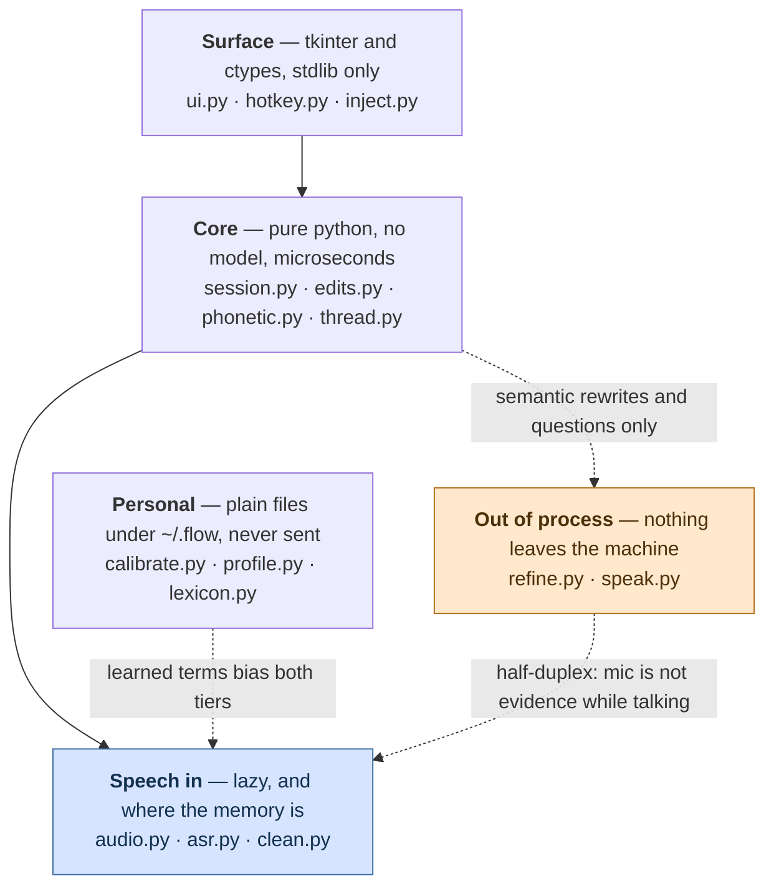
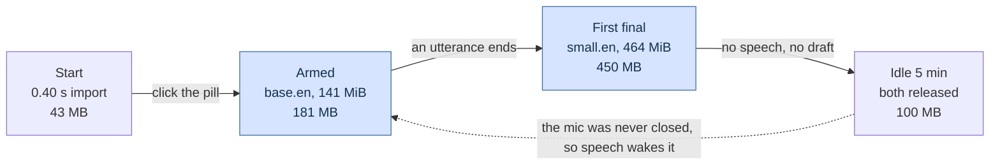

# Architecture — how Flow actually runs

The runtime reference. [product.md](product.md) says what Flow is for, [analysis.md](analysis.md)
records the design decisions and the options rejected, [roadmap.md](roadmap.md) maps the gap
between the two. This file is the thing you read before changing code: what runs where,
what talks to what, and which constants have a measurement behind them.

Every constant quoted here was read from the source, and every runtime claim was checked
against a run — see [Verification](#verification) at the end.

---

## 1. The parts

Seventeen modules in five bands. The bands are drawn by *cost*, not by feature: the top
two are pure Python and stdlib, which is why the pill is on screen in 0.40 s and why a
literal correction is microseconds. The three declared dependencies only matter in one
box, and only two boxes are another process.



The three dotted edges are the couplings that are not obvious from the data flow below:
the agent CLI is reached only for a rewrite or a question, Flow goes deaf while it talks,
and what the profile learns is merged into the lexicon at read time — never written into
the user's own file — so the merged result biases both decoder tiers.

| Module | Band | Does |
|---|---|---|
| `ui.py` | surface | the pill and the draft bubble, DPI-aware |
| `hotkey.py` | surface | `RegisterHotKey` on its own message-loop thread |
| `inject.py` | surface | clipboard + `SendInput`, terminal-safe paste (P7) |
| `session.py` | core | the state machine and the pump |
| `edits.py` | core | routes an utterance, applies the local edits |
| `phonetic.py` | core | vendored Double Metaphone, span search |
| `thread.py` | core | what has already been sent (P6) |
| `audio.py` | speech | mic capture and the speech gate |
| `asr.py` | speech | faster-whisper in two tiers — **the only module that holds a model** |
| `clean.py` | speech | rejects text the model invented, with the evidence |
| `calibrate.py` | personal | measures this room and this voice (P8) |
| `profile.py` | personal | what was measured and learned, as JSON |
| `lexicon.py` | personal | the user's own terms, re-read on change |
| `refine.py` | external | rewrite, polish (P5) and converse ask (P9) |
| `speak.py` | external | one long-lived SAPI host; owns `speaking`, which gates the mic |

## 2. The loop, end to end

```
  microphone
      │  float32 mono, 16 kHz, 1024-sample blocks (64 ms)
      ▼
  Mic ─────────────── bounded queue, 256 blocks, drops oldest when full
      │
      ▼
  SpeechGate ──────── RMS vs an adaptive noise floor, 800 ms hangover,
      │               256 ms of pre-roll handed back when it opens
      ▼
  utterance buffer ── cut and committed at 24 s, whatever else happens
      │
      ├── every ≥0.7 s of new audio, if the worker is free ──▶ partial decode
      └── on end-of-speech, or at the 24 s cut ──────────────▶ final decode
      │
      ▼
  DecodeWorker ────── one thread. Partials latest-wins, finals FIFO,
      │               rescues FIFO. A decode failure never kills it.
      ▼
  clean.invented_reason ── two signals must agree before anything is dropped;
      │                    every rejection is kept with its evidence
      ▼
  Session._route ──── append | local | semantic | undo | rescue | recall | followup
      │
      ├── append ────▶ Draft.append
      ├── local ─────▶ edits.apply_local          microseconds, no subprocess
      ├── undo ──────▶ Draft.undo
      ├── rescue ────▶ re-read the last append as a command
      ├── recall ────▶ pull the last sent prompt back
      ├── followup ──▶ mark the draft as a continuation
      └── semantic ──▶ refine.refine()            agent CLI, ~6 s, off-thread
      │
      ▼
  Draft (text + bounded undo stack)
      │
      ▼
  Send
      ├── DICTATE  ──▶ inject.paste()   clipboard + SendInput, terminal-aware
      └── CONVERSE ──▶ refine.ask()     agent CLI, reply rendered + spoken
                            │
                            └──▶ Thread (bounded), so the next question has context
```

The rule that shapes all of it: **the agent CLI is never on the hot path.** A CLI call was
measured at ~7 s, which is slower than fixing a word by hand, so `edits.py` exists to keep
every literal correction away from it.

## 3. Threads

Ten things run concurrently. Getting this wrong is the main way to break the app, so it
is written down.

| Thread | Started by | Does | Rules |
|---|---|---|---|
| main / UI | `Pill.mainloop()` | `Pill._tick()` every 30 ms → poll the foreground → `Session.tick()` → repaint | **The only thread that may touch Tk.** `_tick` re-schedules itself in a `finally`, so an exception cannot break the chain and leave a dead pill on screen. The foreground poll is two user-mode calls and is where `paste_target` comes from — asking at paste time asks after the click. The one thing that stops this thread is the right-click menu, which is a native `TrackPopupMenu` running its own modal loop |
| PortAudio callback | `Mic.start()` | copies each block into the queue, updates the level | No allocation-heavy or blocking work. Never touches the session — which is exactly why `Mic.level_db` is not what the meter draws: it reports the room whether or not anything is reading the blocks. `Session.level_db` is the honest one |
| `decode` | `DecodeWorker.__init__` | runs the model | Owns the only model calls. Catches every exception and turns it into an `error` result |
| `preload` | `Session.start()` | warms both tiers | Not awaited — a first run includes a model download, and doing it inline froze the UI on the first click |
| `hotkeys` | `Hotkeys.start()` | `RegisterHotKey` + `GetMessageW` message loop | `RegisterHotKey` requires the message loop to be on the registering thread. Presses go back through a `queue`, drained on the UI thread |
| `refine` | per semantic rewrite | one `subprocess.run` | Result handed back under `_refine_lock` |
| `ask` | per converse question | one `subprocess.run` | Result handed back under `_ask_lock` |
| clipboard restore | per paste | sleeps 0.6 s, puts the old clipboard back | Lets the target app read the clipboard first |
| `speech` watcher | each `Speaker.say()` | polls the host until it reports `Ready`, then clears `speaking` | Best-effort only. The ceiling that actually bounds `speaking` is enforced by the reader, so a wedged host cannot leave Flow deaf |
| speech host | first spoken reply | a long-lived PowerShell `System.Speech` process | Not a thread but a subprocess, and deliberately long-lived: a subprocess already launched cannot be told to stop talking, and the state protocol needs it responsive |

Locks: `WhisperTranscriber._lock` (model dict + drop log + confidence), one
`WhisperTranscriber._locks[tier]` per tier held across a model build, `DecodeWorker._cv`,
`Session._refine_lock`, `Session._ask_lock`, `Mic._lock`, `Lexicon._lock`, `Speaker._lock`.

The per-tier lock is not decoration: without it the preload thread and the decode worker
each build a model and one is thrown away. Held *per tier* so preloading `small.en` cannot
block a partial that only needs `base.en`.

## 4. The pump

`Session.tick()` is a pump the caller drives — `tkinter.after()` in the app, a `while` loop
in the headless harnesses. No UI framework is imported in `session.py`.

```python
def tick(self):
    self._pump_audio()     # drain mic, run the gate, submit partials/finals
    self.pump_results()    # everything not waiting on the microphone
    self._pump_health()    # device liveness, idle model unload (R8)

def pump_results(self):
    self._pump_decodes()   # take decode results, route them
    self._pump_drops()     # surface what the filter rejected (P2)
    self._pump_refine()    # collect a finished CLI rewrite
    self._pump_ask()       # collect a finished CLI answer
```

**The split is not cosmetic.** The UI drives the pump only while it is capturing, so
folding the CLI collectors into the audio path meant a disarmed pill lost whatever was in
flight: an answer came back onto `_ask_result` and stayed there forever, because the only
code that reads it sat behind the armed check. A question you have already asked does not
depend on still listening — and disarming while waiting is the obvious thing to do, all
the more so now that Flow goes deaf while it reads a reply aloud.

`Session.events()` drains what happened. The UI never reads session internals; it reacts to
the event stream.

### States

| State | Pill | Indicator | Bars | Meaning |
|---|---|---|---|---|
| `IDLE` | slate | — | live | not capturing, or nothing held |
| `LISTENING` | green | — | live | speech in progress |
| `DRAFT` | amber | — (`Ask 4s` on the button) | live | text held, awaiting refine / continue / send |
| `REFINING` | blue | ⋯ `refining` | live | a CLI rewrite is in flight, ~6 s |
| `ASKING` | violet | ⋯ `asking` | live | a converse-mode question is with the CLI, ~8–10 s |

### What Flow is doing, and whether it can hear

`State` is not the whole answer. Three of the things the user waits on are not states at
all — a model build, a decode, and a reply playing — and before this they were invisible,
or worse. `Session.activity` is the one place that answers "what is Flow doing right now",
read every frame by the UI:

| Condition | Indicator | `hearing` |
|---|---|---|
| `speaker.speaking` | ▬ `speaking - not listening` | **False** |
| `state is ASKING` | ⋯ `asking` | True |
| `state is REFINING` | ⋯ `refining` | True |
| `asr.loading` | ⋯ `loading the model` | True |
| `worker.busy and not gate.speaking` | ⋯ `decoding` | True |
| otherwise | — | True |

Checked in that order. Speaking wins because it is the only one that means *stop talking*
rather than *wait a moment*, and a model build is named before the decode it is holding up
because those differ by about a second.

Three points that are load-bearing rather than stylistic:

**It is a polled property, not an event.** A wait has no edges — it is a condition that
holds for a while — and a UI reconstructing "still working" from a start event and an end
event shows a stale indicator the first time one of those is missed.

**Dots for the indeterminate ones, a flat line for the deaf one.** Three marching dots is
the honest shape for a wait of unknown length, where a progress bar has to invent a
denominator. The flat line is the same mark the pill's level bars make at the same moment:
one fact, drawn the same way, in the two places the user is already looking.

**`decoding` is suppressed while the gate is open.** Partials run continuously during
speech, so it would be lit permanently and would say nothing; the bars carry that moment.

**`Session.level_db` is floored to `DEAF_DB` while `hearing` is false.** `Mic._level` is
written by the PortAudio callback, which knows nothing about the echo guard, so during a
spoken reply it tracks Flow's own voice coming back through the speakers — see the
[Verification](#verification) row for what that measured.

### Events

| Kind | Payload | UI response |
|---|---|---|
| `partial` | provisional text | dimmed italic line in the bubble |
| `draft` | the whole held draft | main bubble text; empty hides it, unless `ASKING` |
| `state` | new state name | pill colour |
| `note` | what just happened | small line at the bubble's foot |
| `error` | what failed | red flash + note; the draft is never lost |
| `reply` | the CLI's answer | its own colour, plus spoken aloud |
| `mode` | `dictate` / `converse` | pill badge and chip label (an accompanying `note` is what the user reads) |
| `drop` | a rejected segment with its evidence | shown as a note — P2 is that a rejection is never *silent* |

## 5. Decoding

Two tiers, because one model cannot serve both paths on this CPU.

| | partials | finals |
|---|---|---|
| model | `base.en` | `small.en` |
| beam | 1 | 5 |
| temperature ladder | `(0.0,)` — no retries at all | `(0.0, 0.2, 0.4)` — capped |
| bound by | latency (R4, 1.5 s budget) | accuracy — the draft is held on screen while it runs |

`decode_options()` in [`flow/asr.py`](../flow/asr.py) is the single source both the app and
the benchmarks decode with; a bench that drifts from the app measures a build nobody runs.

Three settings are deliberately non-default:

- `vad_filter=False` — `SpeechGate` already decided this is speech. This is also why
  `onnxruntime` is unreachable and `scripts/slim.py` can remove it.
- `condition_on_previous_text=False` — with context carry-over a long session can fall into
  repetition loops where the model echoes earlier text forever (R8).
- `no_speech_threshold=None` and `log_prob_threshold=None` — these turn off faster-whisper's
  *own* internal segment filter, so Flow has exactly one filter: its own, which records what
  it drops and why. Retrying a decode merely because the model was unsure was measured to buy
  nothing across five accent groups and to cost a lot on near-silence (one 5 s noise clip went
  0.84 s → 3.66 s). Degenerate output still retries, through `compression_ratio_threshold` —
  that is the case where a hotter sample genuinely helps.

Capping the ladder removes Whisper's own escape from repetition loops, so
`clean.collapse_repeats()` and `clean.collapse_phrase_repeats()` break them deterministically
instead.

### Loading, and what it costs



Each tier loads lazily and independently, which is the point: a session that shows partials
and never finalises an utterance never pays for `small.en` at all. `Session.start()` spawns
the preload thread and does **not** await it — a first run includes the download, and doing
that inline froze the whole UI on the first click with nothing on screen to explain why.

The idle unload at `IDLE_UNLOAD_SEC` releases both models and **keeps the microphone open**.
That is a deliberate narrowing of the original design, which released the mic too: releasing
it would leave the app unable to hear its own wake-up, and a mic is cheap where a model is
hundreds of megabytes.

Memory figures are recorded from earlier soak runs, not re-measured for this document.

### The drop filter

`clean.invented_reason()` returns which rule rejected a segment, or `None` to keep it.
**Two independent signals must agree before anything is discarded**, because dropping a real
word is worse than admitting a rare invented one — the user can delete a stray word but
cannot recover one they were never shown.

```
no_speech_prob ≤ 0.6                         → keep
no_speech_prob > 0.6  and  whole utterance is a known filler   → "filler"
no_speech_prob > 0.6  and  avg_logprob < confidence_floor      → "unconfident"
otherwise                                     → keep
```

`confidence_floor(baseline)` is `min(-0.8, baseline - 0.5)` — `min`, so calibration can only
ever *relax* the bar. Shortness is deliberately **not** a signal: a spoken correction *is*
short, so dropping on length preferentially deletes commands from the people whose speech
scores worst on `no_speech_prob`, which is exactly the user Flow is for.

## 6. Routing

`edits.plan(utterance, draft)` decides what a spoken utterance means. The draft is a required
argument, not decoration: *"Delete key handling is broken"* is dictation and *"delete key
handling"* is an instruction, and nothing in the words separates them — what separates them
is whether the target text exists in the draft.

Two passes. The utterance is read as spoken; only if that produces no local edit is it
re-read with a snapped verb, and **that reading is accepted only when it yields a local edit
whose target is really in the draft.** So a guess can promote a mis-heard command and can
never demote dictation into an edit.

| Plan kind | Trigger | Cost |
|---|---|---|
| `rescue` | "that was a command / an instruction / an edit" | re-read, ~2 s if it needs the audio |
| `recall` | "bring back my last prompt" | instant |
| `followup` | "follow up", "also", "one more thing" (+ optional rest) | instant |
| `undo` | "scratch that", "undo", "never mind", "forget that", "strike that" | instant |
| `local` | a literal correction whose target is in the draft | microseconds |
| `semantic` | a rewrite verb, or `op="polish"` | ~6 s, agent CLI |
| `append` | everything else | instant |

Local operations: `replace`, `replace_all`, `delete`, `delete_last`, `delete_range`,
`insert_before`, `insert_after`, `capitalize`, `upper`, `lower`, `break`.

Three mechanisms make the grammar survive an accent:

**Lead-in absorption.** Every pattern takes a repeatable prefix of hesitation *and*
politeness — `no`, `sorry`, `wait`, `actually`, `can you`, `could you please`, `just`, `let's`.
Politeness was the missing half: those forms were being appended into the draft verbatim.

**Verb snapping.** Edit distance (bounded at one), adjacent transposition, suffix stripping
(`deleting` → `delete`), and an explicit table of observed mis-hearings (`the lead` → delete,
`stop` → swap, `leplace` → replace). Only applied to utterances of ≤ 6 words after the
lead-in, because every command in the inventory is five words or fewer and a guess about a
long utterance is a guess about a sentence.

**Phonetic target matching.** `phonetic.find_span()` — vendored Double Metaphone blended with
spelling, threshold `MATCH_THRESHOLD = 0.82`, searching word windows sized around the
target's own word count ±1, because a mis-transcription moves word boundaries as readily as
letters. Both the router's `in_draft()` and every span operation in `apply_local()` go
through it.

`plan()` also marks `escalated=True` when the shape was a correction but the target was
nowhere in the draft. That is likelier a mis-hearing than a request for judgement, so it
earns one biased re-decode (`edits.command_bias()`: every trigger verb plus the draft's own
long words, capped at 48 terms) before any CLI call.

## 7. Send

### Dictate

`inject.paste()` classifies the target window **before** it touches the clipboard — window
class or process name, via ctypes — then `prepare()` decides what is safe to send.

**Which window is the target is not a question to ask at paste time.** It used to be:
`paste()` called `GetForegroundWindow()` itself, which runs *after* the click on the Send
chip. Neither of Flow's toplevels carried `WS_EX_NOACTIVATE` — measured exstyle `0x00080088`
on both, TOPMOST | TOOLWINDOW | LAYERED — so that click made Flow the foreground window and
the answer was Flow. Everything downstream then followed from a Tk canvas: the `SendInput`
Ctrl-V went to a widget that ignores it, `prepare()` decided a canvas is not a terminal and
skipped the newline strip that is P7's one guarantee, and `paste()` returned True anyway.
Measured before the fix, with a real mouse click on the chip: nothing arrived in an
ordinary window, nothing arrived in a console, and Send reported success both times. Not
one prompt had ever landed this way.

Three things now hold, and they are independent on purpose:

1. **Both toplevels carry `WS_EX_NOACTIVATE`**, applied by `ui._no_activate` after the
   windows exist and **read back** — `SetWindowLongPtr` returns the previous style word, so
   a call that did nothing is indistinguishable from one that worked unless you ask again.
   It has to be set on the `TkTopLevel` parent of `winfo_id()`, not on the `TkChild` it
   returns; the first version wrote it to the child *and read it back off the child*, and
   the read-back agreed with itself.
2. **The caller names the window.** `Pill._tick` polls the foreground every 30 ms and keeps
   the last one that was not Flow's own, and `Pill._send` passes it to `paste(hwnd=…)`.
   That is what fixes the *classification*, independently of where the keystroke goes.
3. **A target that resolves to Flow is refused**, with a reason, because a Ctrl-V into
   Flow's own canvas does nothing whatever the caller believes. See invariant 10.

The one guarantee: a draft ending in a newline never reaches a shell with that newline
attached, because that does not paste, it *runs*. Interior newlines are explicitly not a
guarantee and are reported rather than rewritten; silently reflowing someone's text to make
it safe is worse than telling them. Those reports had never been shown to anyone either —
`inject.take_warnings()` existed, was imported by `__main__`, and was drained by nobody.

### What Send leaves behind

The bubble used to be withdrawn on the same line that sent the draft, so a paste that
landed and a paste that went nowhere left the same empty screen. It now holds the sent text
for `ui.SENT_LINGER_SEC` under a `sent` label with a **Put it back** chip, which calls
`Session.recall()` — the same path the spoken *"bring back my last prompt"* takes. Dictate
mode only: in converse mode the bubble is already staying up for the answer.

### Converse

`Session.send()` returns `""` in converse mode by construction, so the question can never be
pasted into whatever window happened to have focus. The draft goes to `refine.ask()` with the
thread tail *minus the current turn* — passing the current one would ask the CLI not to answer
the thing it was just asked.

`ask()` is deliberately not `refine()`. `refine()` guards hard against the model returning
anything longer than what it was given, because commentary pasted into a draft is a defect.
An answer *is* commentary, so that guard would reject every correct result.

## 8. Constants, and what is behind them

Only the ones with a measurement or a failure behind them. Everything else is in the source.

| Constant | Value | Why |
|---|---|---|
| `MAX_UTTERANCE_SEC` | 24.0 s | Whisper pads to one 30 s mel window, so cost is flat below it and climbs past it. Cut before the boundary keeps latency constant in a long session |
| `PARTIAL_MIN_GROWTH_SEC` | 0.7 s | Paired with the worker-idle check, this is what bounds partial latency |
| `IDLE_UNLOAD_SEC` | 300 s | Release the models, keep the mic. Releasing the mic would leave the app unable to hear its own wake-up |
| `MIC_CHECK_SEC` | 5 s | A dead PortAudio stream stops delivering blocks without raising anywhere the session can see |
| `FORCE_NEXT_TTL_SEC` | 30 s | A Refine/Continue chip means "the next thing I say"; after this long the next thing someone says is a different thought. The chips also toggle, because a one-way door that lasts 30 s reads as the app being stuck |
| `AUTO_ASK_SEC` | 4 s | Converse mode only. Measured: the pauses a speaker leaves between separate spoken items run 1.4–3.3 s (median 2.5 s) on the one recording where every item was located, and each gap also contains a spoken item number, so real silence is shorter — under ~3.3 s fires mid-thought. R5 still holds where it matters: pasting into a window is irreversible and stays manual, asking is not |
| `ui.SENT_LINGER_SEC` | 4 s | How long the bubble holds what a dictate-mode Send just handed over, with the chip that puts it back. Deliberately **not** `AUTO_ASK_SEC`, which is also 4 s and is a different four seconds: that one is how long a settled draft waits before asking itself, this is how long words stay recoverable after they have gone, and either could move without the other. The number it replaces was zero — the bubble was withdrawn on Send, so a Send that went nowhere and a Send that worked left the same empty screen |
| `ui.DOT_SEC` | 0.4 s | One dot of the indeterminate-wait animation. The bubble renders on events and a wait has no events, so the frame is computed and compared before anything is drawn — at this cadence that is ~2.5 repaints a second instead of the 33 that redrawing every pump would cost. Same discipline as the auto-ask countdown |
| `DEAF_DB` | −120.0 | What `level_db` reports while the microphone is not evidence. Below any real room — a quiet room with a good USB mic measures −96.7 dB — so every meter maps it to silence without having to know why |
| `speak.WORDS_PER_SEC` | 1.5 | Half the measured rate (a 15-word sentence took 4.9 s at rate 1), so the derived ceiling on `speaking` is generous. It gates the microphone, and a latched value would leave Flow permanently deaf — far worse than leaking a little echo |
| `BLOCK` | 1024 (64 ms) | Fine enough for a responsive level meter |
| `PREROLL_BLOCKS` | 4 (256 ms) | A gate can only open after hearing something loud, so the quiet head of that word is already gone — the unaspirated stop, the soft fricative. Without it "delete" becomes "leet". Measured: gating without pre-roll deletes 2.6% of the audio; any pre-roll from 128 ms up returns WER to the ungated level |
| `FLOOR_MIN_DB` | −100.0 | It was −70, and a quiet room with a good USB mic measures **−96.7 dB** — the floor could never descend to meet it, so the gate never opened at all |
| `FLOOR_MAX_DB` | −25.0 | So no input can make the gate deaf |
| `NO_SPEECH_MAX` | 0.6 | Sits clear of a genuine short fragment (0.099 measured) and below an outright hallucination (0.691) |
| `LOW_CONFIDENCE` | −0.8 | The shipped absolute bar, and the reason `CONFIDENCE_MARGIN` exists |
| `CONFIDENCE_MARGIN` | −0.5 | The distance between the US control's −0.29 median and the shipped −0.8, so a calibrated typical speaker keeps exactly the behaviour they had |
| `MATCH_THRESHOLD` | 0.82 | Swept, not chosen: 10/10 real mis-transcription pairs recovered at 4 false spans in 354; stricter costs three recoveries and buys nothing until 0.90 |
| `SNAP_MAX_WORDS` | 6 | Without it, suffix-stripping turned sentence-opening gerunds into commands — "Deleting a branch does not delete the history" became a delete |
| `refine.MAX_CHARS` | 2000 | Never hand the CLI an unbounded draft (R11). Past this only the tail is sent, cut on a sentence boundary |
| `refine.TIMEOUT_SEC` | 20 s | Measurement put a normal call at 5.7–7.3 s, so the 6 s first sketched would have killed healthy calls |
| `ASK_SENTENCES` | 3 | The shortest that can carry an answer plus its caveat |
| `ASK_MAX_CHARS` | 4000 | The bubble has to render it |
| `Thread.MAX_TURNS` / `MAX_CHARS` | 20 / 20 000 | R8. Measured: 5000 sends of a realistic prompt settle at 20 turns, 1640 chars |
| `CONTEXT_CHARS` | 1500 | What a CLI rewrite may see — smaller than the store, because context disambiguates a follow-up rather than re-sending the conversation |
| `Lexicon.MAX_TERMS` | 64 | The library truncates its prompt at 223 tokens *silently, mid-term*, which would bias toward a fragment |
| `Profile.PROMOTE_AFTER` | 2 | One "change X to Y" is as likely to be the user changing their mind as the model mishearing; twice is a pattern |
| `Draft.MAX_HISTORY` / `MAX_HISTORY_CHARS` | 30 / 200 000 | 30 snapshots of a very long draft is where undo quietly becomes megabytes |

## 9. What is written to disk

| Path | When | What |
|---|---|---|
| `~/.flow/lexicon.txt` | never by Flow | the user's own terms. Read-only to the app; re-read by mtime on every decode |
| `~/.flow/profile.json` | `--calibrate`, and every Send | schema 1. Room, voice, this speaker's confidence, learned confusion pairs, misroute signatures. Written whole to a `.tmp` and moved, so a crash cannot leave a profile that loads as garbage |
| `~/.cache/huggingface/hub/` | first decode of each tier | the models |
| `.bench/` | `scripts/` only | generated audio, benchmark results and the volunteer recordings. **Tracked**, because a result is a measurement taken at a moment and a recording is a person — neither is reproducible by re-running anything. The downloadable accent corpora are excluded and their manifests are not; [`.bench/README.md`](../.bench/README.md) is the inventory |

Send is the commit point for the profile: rare, user-initiated, and the moment a session's
corrections have proved themselves by surviving to a handoff.

There is no code in `profile.py` that could send anything anywhere. R9 is not enforced by
policy here; it is enforced by absence.

## 10. Invariants worth not breaking

1. **Tk is touched from one thread.** Hotkeys, decodes, refines and asks all hand results
   back through a queue or a lock and are drained on the UI thread.
2. **The CLI is never on the correction path.** Only `semantic` plans and converse questions
   start a subprocess.
3. **Failure is non-destructive.** Every CLI path returns `(None, reason)` and the caller
   keeps the pre-edit draft. A rescue that fails puts the words back exactly where they were.
4. **Nothing is dropped silently.** A rejected segment becomes a `drop` event with its
   evidence; a destructive edit reports the words it removed; the undo stack still holds them.
5. **Nothing sends itself.** Stopping speech produces a held draft. Send is always explicit.
   A Send that refuses says why — a button that does nothing reads as broken.
6. **Flow does not listen to itself, and does not claim to.** While a reply is playing the
   microphone is not evidence. There is no echo cancellation and there is not going to be
   one (R16), so converse mode is half-duplex and interrupting is an explicit action. A VAD
   does not solve this: the speakers genuinely are producing speech, and a detector will say
   so. The second half of that sentence is the newer half — the guard was discarding audio
   correctly while the level meter animated to the discarded blocks, so the app told the
   truth about what it did and lied about what it heard.
7. **Everything is bounded.** Mic queue, undo history, drop log, decode timings, thread turns,
   lexicon terms, profile pairs, CLI input. A long session must cost what a short one costs.
8. **Three declared dependencies.** GUI, hotkeys, injection, DPI awareness and speech all come
   from `tkinter` and `ctypes` precisely so that list does not grow.
9. **`decode_options()` is the only place decode parameters live**, so the benchmarks measure
   the build that ships.
10. **Flow does not paste into itself.** Its own windows are out of the activation chain, the
    window a paste is aimed at is chosen before the click rather than after it, and a target
    that still resolves to Flow's own process is refused with a reason. This is new because
    it had never held: the Ctrl-V went to a Tk canvas, which ignores it, and `paste()`
    returned True — a failure with no symptom anywhere, which is why it survived every
    harness in the list below.

## 11. Testing layers

| Layer | Harness | What it can and cannot see |
|---|---|---|
| units | `tests/` (437 tests, ~3 s) | routing, filters, phonetics, state machine, resilience — with a fake transcriber, so no mic or model needed. Cannot see wiring |
| one layer, real audio | `scripts/*_bench.py` | WER, latency, gate behaviour, command recall — real models on real recordings. Cannot see the app |
| whole app | `scripts/selfdrive.py` | SAPI speaks → real `Session` → real gate → real two-tier decode → real router → assertions on the draft. 64 checks, including converse against the live CLI, and `scenario_chips` clicking real chips and reading the indicator and the level meter off the canvas. Cannot see accent — SAPI is a US-English synthesiser. **Cannot see focus**: `event_generate` hands Tk an event without Windows ever being involved, so the click it makes cannot move the foreground and cannot reproduce the defect that made Send useless |
| the real mouse | `scripts/send_check.py --live` | the only layer that can answer *did the words arrive*. Opens a window and a console, clicks Send at the coordinates the chip is drawn at with a real `SendInput` mouse click, and reads back what landed in each. Also reads `WS_EX_NOACTIVATE` off both toplevels, and exercises the right-click menu and a drag, because those are what a non-activating window can lose |
| looking at it | `scripts/ui_probe.py` | renders the pill and bubble against a fake session that walks every state, so there is something to screenshot without a microphone, a model or a person. `--hold STATE` pins one; `--bare` drops the draft, which is the case the indicator exists for; `--sent` presses Send, which is the only way to see the card that stays behind |
| a person | `scripts/live_check.py` | the only thing that can answer P1 and P3. Needs recordings that do not exist yet |

The self-drive layer exists because three consecutive sessions each found a defect by hand
that no layer-specific harness could have caught: a chip whose label the grammar rejected, a
mode with no way to turn the voice on, and a window that placed itself off the screen. The
level meter is the fourth of that kind and the reason `ui_probe.py` is listed as a layer
rather than a convenience: every automated layer passed while the bars animated to Flow's
own voice, because no assertion anywhere read what the pill was actually drawing.

`send_check.py` is the fifth, and the worst of them. Every layer above it was green for the
entire life of the project while **no prompt had ever reached a window via the Send chip**,
because the thing that broke it — a click moving the foreground — is precisely the thing a
synthetic Tk event cannot do. A harness that cannot reproduce the defect cannot see it, and
`paste()` returned True, so nothing else could either.

## Verification

Everything above was checked on 2026-07-31, Windows 11, CPU-only, int8. The rows marked **↻**
were re-measured on 2026-08-01 — four when the indicator was added, and the Send rows when
the paste target was fixed; the rest are as recorded on the 31st and were not re-run.

| Check | Command | Result |
|---|---|---|
| unit tests ↻ | `uv run python -m unittest discover -s tests` | **437 passed**, 3.3 s |
| end-to-end ↻ | `uv run python scripts/selfdrive.py` | **64/64 checks passed**, including a live `codex` converse round trip and a spoken reply |
| **does Send arrive** ↻ | `uv run python scripts/send_check.py --live`, a real mouse click on the chip | **before: 6/12.** Extended styles `0x00080088` on both toplevels; an ordinary window *unchanged — nothing arrived*; a console with *nothing there to run*; and `paste()` reported success both times. **After: 18/18**, three consecutive runs. `0x08080088` on both, the marker text in the window, the command in the console, and it ran only once Enter was pressed by hand |
| the menu and the drag ↻ | same run, `== the pill itself` | The menu opens and dismisses, holds the foreground while it is up and gives it back; the pill tracks the cursor to the pixel. Both measured because both are what `WS_EX_NOACTIVATE` can break — and the first attempt did break the menu outright: it posted and `tk_popup` never returned |
| the level meter ↻ | drive a session with `speaker.speaking` true and a loud mic | before: 30 blocks discarded by the echo guard and the meter still at **83% of full scale**. After: 30 discarded, meter at **0%**, `level_db` −120 dB |
| the indicator ↻ | `scripts/ui_probe.py --hold STATE`, screenshotted | every state in the table above renders its own row; the pill's bars and the bubble's flat line agree in the speaking state |
| flags | `uv run python -m flow --help` | 13 flags, matching the README table |
| build | `uv build`, then install the wheel into a fresh venv | wheel + sdist built; `flow --help` runs from a clean install. `hatchling` stays out of the runtime venv, so R16 holds |
| hotkeys ↻ | `flow.hotkey.DEFAULT_BINDINGS` | 5 actions, 1–3 fallbacks each. `quit` is the new one: `Esc` was a Tk binding, and a window that never takes focus can never receive it |
| agent CLI | `flow.refine.available()` | `codex`, then `claude` |
| speech | `flow.speak.Speaker().available` | `True` |
| speech state | `Speaker.say()` then poll `speaking` | `True` at t=0.00 s (gated before the first phoneme), cleared by the watcher at 7.7 s for a 23-word sentence, and cleared immediately when the host is killed |
| echo guard | same scenario with and without the guard | without: the draft gains text transcribed from the reply playing through the speakers. With: nothing, and 50 blocks counted as discarded |
| install | `uv run python scripts/slim.py` | 243.9 MB venv, 28 distributions |
| models | HuggingFace cache blob sizes | `base.en` 147.8 MB, `small.en` 486.1 MB |

Constants were read from source rather than from memory. Numbers attributed to earlier runs
(WER, soak drift, CLI latency) are quoted from [../PROGRESS.md](../PROGRESS.md) and
[roadmap.md](roadmap.md) and were **not** re-measured here; they are labelled as recorded
wherever they appear.
